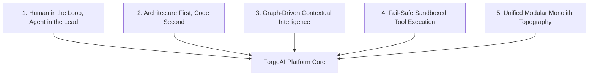

# 00. ForgeAI Overview & Strategic Foundation

## Executive Summary

**ForgeAI** is an AI Engineering Platform designed as an **Operating System for Software Engineering**.

Unlike traditional AI coding assistants that operate solely as localized code auto-completers or siloed chatbots, ForgeAI orchestrates human engineers and specialized AI agents in a shared, observable environment. Together, humans and autonomous AI agents collaboratively plan, design, architect, build, test, review, deploy, monitor, and continuously evolve software systems.

---

## 🎯 Vision & Mission

### Vision
To empower engineering organizations to build software at 10x velocity with zero compromise on architectural integrity, security, or maintainability by seamlessly fusing human creativity with autonomous AI agent orchestrations.

### Mission
To provide a unified, enterprise-grade operating system that bridges product management, software architecture, agent execution, codebase evolution, deployment observability, and real-time governance into a single, cohesive modular application.

---

## 💡 Strategic Product Goals

1. **Unified Engineering Lifecycle**: Eliminate context switching between issue trackers, design tools, code editors, CI/CD pipelines, and AI chats by unifying them under an interactive **Engineering Graph**.
2. **Deterministic Agent Collaboration**: Move beyond opaque LLM prompts by enforcing structured agent state machines, typed tool invocations, human-in-the-loop (HITL) approval gates, and rigorous Pest evaluation harnesses.
3. **Enterprise Governance & Token Discipline**: Enforce strict organization multi-tenancy, granular RBAC/ABAC access control, immutable token usage ledgers, and zero-trust security controls.
4. **Sub-Second Reactive Ergonomics**: Deliver real-time Server-Sent Event (SSE) streaming for agent thought streams, token output, and engineering graph updates using **Inertia.js v3 + Vue 3**.
5. **Standardized AI Abstraction**: Leverage the first-party **`laravel/ai` SDK** (`Laravel\Ai\*`) to provide dynamic provider failover across OpenAI, Anthropic, Google Gemini, DeepSeek, and local Ollama models.

---

## 🏛️ Design Philosophy & Guiding Principles

1. **Human in the Loop, Agent in the Lead**: AI agents autonomously perform research, draft architectural plans, execute sandboxed code changes, and run test suites. Humans retain full strategic authority, reviewing and approving high-consequence actions via explicit UI gates.
2. **Architecture First, Code Second**: No code is generated without an underlying architectural specification, domain aggregate boundary, or Architectural Decision Record (ADR).
3. **Graph-Driven Contextual Intelligence**: Every entity—from user requirements and ADRs to commits, unit tests, and production incidents—is indexed as nodes in an **Engineering Graph**, providing deep contextual ground truth for AI reasoning.
4. **Fail-Safe Sandboxed Tool Execution**: Agent tools (e.g. executing scripts, running SQL queries, mutating source code) run within restricted subprocess sandboxes with strict time limits, memory caps, and PII redaction.
5. **Unified Modular Monolith Topography**: Built on **Laravel 13** and **Inertia v3**, ForgeAI avoids microservices complexity in favor of clean DDD domain modules (`app/Domain/*`) that communicate via typed events and Redis Horizon queues.

---

## 📖 Ubiquitous Terminology Glossary

| Term | Definition |
|---|---|
| **ForgeAI Engine** | The primary orchestration framework managing AI model drivers, prompt assembly, and context streaming via `laravel/ai`. |
| **Agent Persona** | A specialized AI entity configured with a system prompt, role-specific tools, and context window rules (e.g. Architect Agent, Security Agent). |
| **Engineering Graph** | A connected property graph indexing all artifacts in the engineering lifecycle (Features, ADRs, Code, Tests, Incidents). |
| **Execution Session** | A stateful thread of interaction between a user, an Agent, and tool invocations. |
| **Human-in-the-Loop (HITL)** | A security gate halting agent execution until a human engineer explicitly authorizes a high-risk tool call. |
| **Model Context Protocol (MCP)** | An open protocol allowing ForgeAI to connect dynamically with external tool servers and IDE clients. |
| **Token Ledger** | An append-only financial accounting database tracking prompt/completion token consumption and USD costs per tenant. |

---

## 🔗 Related Architecture Documents

- [01-product-requirements.md](file:///home/tristan/Projects/Forge_AI/docs/01-product-requirements.md)
- [02-domain-driven-design.md](file:///home/tristan/Projects/Forge_AI/docs/02-domain-driven-design.md)
- [04-system-architecture.md](file:///home/tristan/Projects/Forge_AI/docs/04-system-architecture.md)
