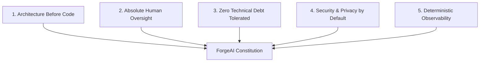

# 01. ForgeAI Constitution & Supreme Principles

## Executive Summary

The **ForgeAI Constitution** is the highest authority within the ForgeAI engineering ecosystem.

Every technical decision, pull request, AI agent execution, architectural design, and product feature MUST comply strictly with the non-negotiable principles established in this document.

---

## 🏛️ Article I: Supreme Vision & Mission

### Vision
To redefine human-computer collaboration by establishing an operating system for software engineering where autonomous AI agent swarms and human software leads co-create enterprise software at 10x velocity without degrading code quality, security, or maintainability.

### Mission
To build a resilient, modular, observable, and secure platform that unifies product management, domain-driven architecture, automated testing, agent orchestration, and real-time governance into a single cohesive system.

---

## 🛡️ Article II: Non-Negotiable Core Values

1. **Architecture Before Code**: No line of production code shall be generated or staged without an underlying architectural specification, domain aggregate boundary, or Architectural Decision Record (ADR).
2. **Absolute Human Oversight**: AI agents lead task execution, but human engineers retain exclusive authorization over high-consequence actions (e.g. database schema mutations, production releases, external API writes).
3. **Zero Technical Debt Tolerated**: Code quality checks (Laravel Pint formatting, Larastan Level 8 static analysis, Pest v4 test suites) are blocking requirements for every commit.
4. **Security & Privacy by Default**: Zero-Trust security applies universally. Secrets are encrypted at rest with AES-256-GCM, tenant data is isolated, and prompt injection filters scan all AI inputs and outputs.
5. **Deterministic Observability**: Opaque agent execution is prohibited. Every prompt, token count, tool invocation, graph traversal, and financial cost MUST be recorded to an append-only audit ledger.

---

## ⚖️ Article III: Decision-Making Guidelines

When trade-offs arise during design or implementation, decision-makers (humans and AI agents) MUST evaluate options against the following priority cascade:

$$\text{Security \& Data Safety} \succ \text{Architectural Maintainability} \succ \text{Developer Ergonomics} \succ \text{Short-Term Delivery Speed}$$

1. **Security Over Speed**: A feature MUST NOT be shipped prematurely if it bypasses authorization gates, tool sandboxing, or prompt injection framing.
2. **Modular Monolith Over Microservices Complexity**: Domain concerns MUST be cleanly separated into modules under `app/Domain/`. Microservices shall only be extracted when independent infrastructure scaling becomes strictly necessary.
3. **First-Party Ecosystem Over Third-Party Hype**: Prefer Laravel first-party packages (`laravel/ai`, Fortify, Horizon, Pail, Wayfinder) over unmaintained external libraries.

---

## 🏆 Article IV: Definition of Engineering Excellence

Engineering Excellence in ForgeAI is achieved when:
- All domain modules maintain strict encapsulation verified by Pest Architecture tests (`tests/Arch/`).
- Frontend components render smoothly with sub-second token streaming using Inertia v3 and Tailwind v4.
- 100% of LLM provider calls implement automated failover cascade policies across OpenAI, Anthropic, Gemini, and Ollama.
- Documentation in `/docs` reflects the exact state of the production system at all times.

---

## 🔗 Related Architecture Documents

- [00-project-foundation.md](file:///home/tristan/Projects/Forge_AI/docs/00-project-foundation.md)
- [02-engineering-standards.md](file:///home/tristan/Projects/Forge_AI/docs/02-engineering-standards.md)
- [05-definition-of-done.md](file:///home/tristan/Projects/Forge_AI/docs/05-definition-of-done.md)
