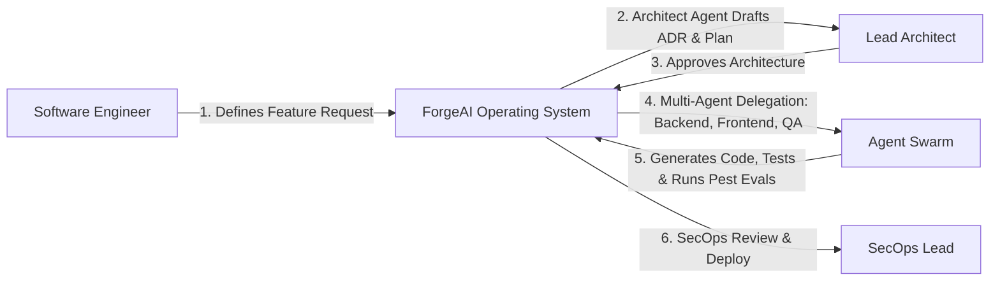

# 01. Product Requirements Document (PRD)

## Executive Summary

This Product Requirements Document (PRD) defines the functional, non-functional, and operational requirements for **ForgeAI**.

ForgeAI transforms software development by unifying human engineers, specialized autonomous AI agents, architectural specifications, and real-time observability into a single platform.

---

## 🎯 Problem Statement

Modern software engineering organizations face significant friction:
1. **Context Fragmentation**: Specifications exist in Jira/Confluence, code lives in GitHub, architecture lives in diagrams, and AI interactions occur in isolated chat tabs with zero shared memory.
2. **Unregulated AI Assistants**: Generic inline AI coders generate code without architectural awareness, introducing technical debt, security flaws, and compliance risks.
3. **Runaway Token Costs**: Enterprises lack granular, real-time token budgeting, leading to unpredicted LLM expenditure spikes.
4. **Lack of Agent Governance**: Current agent frameworks lack deterministic state machines, human approval gates, and rigorous evaluation harnesses.

---

## 👥 Target Personas & User Journeys

### Persona 1: Sarah — Senior Staff Architect
* **Goal**: Maintain strict architectural standards across 15+ engineering teams while accelerating feature delivery.
* **Pain Point**: Engineers bypass architectural blueprints or write code violating DDD module boundaries.
* **Journey in ForgeAI**: Sarah uses the **Architecture Studio** to establish ADRs and DDD aggregate boundaries. When engineers trigger new feature requests, ForgeAI's Architect Agent automatically enforces compliance before code changes are staged.

### Persona 2: Marcus — Lead Software Engineer
* **Goal**: Deliver complex features quickly without getting bogged down in boilerplate, routine test writing, or manual documentation updates.
* **Pain Point**: Constantly switching between terminal, browser, IDE, and AI chat interfaces.
* **Journey in ForgeAI**: Marcus submits a high-level feature goal. ForgeAI's multi-agent swarm plans the changes, writes backend controllers, updates Vue components via Inertia v3, and generates Pest unit tests. Marcus reviews the diff and approves deployment with a single click.

---

## 📋 Functional Requirements Matrix

### 1. AI Agent Orchestration & Workspace
- **FR-1.1**: The platform MUST support configurable multi-agent swarms (Project Manager, Architect, Backend, Frontend, QA, Security, Release).
- **FR-1.2**: Agents MUST execute stateful workflows with explicit pause-points for Human-in-the-Loop (HITL) approval when mutating databases or invoking external APIs.
- **FR-1.3**: Agent thought streams and token outputs MUST stream to the Vue 3 UI in real-time via Server-Sent Events (SSE).

### 2. Engineering Graph & Knowledge Hub
- **FR-2.1**: The platform MUST construct and maintain a bidirectional Engineering Graph indexing Projects, Features, Requirements, ADRs, Commits, PRs, Tests, and Incidents.
- **FR-2.2**: Agents MUST query the Engineering Graph to retrieve exact contextual dependencies before drafting plans or code.
- **FR-2.3**: The Knowledge Hub MUST support vector embedding ingestion (PDF, MD, HTML) using PostgreSQL `pgvector` with sub-10ms cosine retrieval.

### 3. Tool Sandboxing & Automation
- **FR-3.1**: Custom tools MUST execute in isolated subprocess sandboxes with configurable memory limits (128MB) and wall-clock execution timeouts (10s).
- **FR-3.2**: Tool inputs and outputs MUST pass through PII redaction and secret masking filters prior to LLM context inclusion.

### 4. Governance & Token Financials
- **FR-4.1**: The platform MUST log every prompt, completion token count, and estimated USD cost to an append-only transaction ledger (`token_ledgers`).
- **FR-4.2**: Organization admins MUST be able to define monthly token budgets and hard rate limits per user, team, or agent.

---

## ⚡ Non-Functional Requirements (NFR Matrix)

| Category | Requirement Specification | Metric / Enforcement |
|---|---|---|
| **Performance** | Time-To-First-Token (TTFT) < 400ms for streaming responses | Inertia v3 SSE chunking + `laravel/ai` streaming drivers |
| **Availability** | 99.9% uptime for core agent execution APIs | Multi-provider fallback cascade (Anthropic -> OpenAI -> Gemini) |
| **Scale** | Support 10,000+ concurrent background execution jobs | Redis-backed Laravel Horizon worker pool |
| **Data Isolation** | Multi-tenant organization isolation | Global Eloquent tenant query scopes & partitioned vector namespaces |
| **Code Quality** | 100% adherence to Pint formatting and Larastan Level 8 | Pre-commit hooks & automated CI pipeline checking |

---

## 🎯 Scope Boundaries

### MVP Scope (Phase 1-3)
- Modular Monolith architecture on Laravel 13 + Inertia v3 + Vue 3.
- `laravel/ai` SDK integration for OpenAI, Anthropic, Gemini, and Ollama.
- Core 10 Specialist Agent Personas with state machine execution loops.
- Engineering Graph indexing (Features, ADRs, Code, Tests, Incidents).
- PostgreSQL + `pgvector` knowledge retrieval.
- Fortify + Passkey authentication & RBAC.
- Append-only Token Usage Ledger.

### Out-of-Scope for MVP
- Native desktop IDE binary extensions (handled via Model Context Protocol gateway).
- Proprietary self-hosted LLM model training.

---

## 🔗 Related Architecture Documents

- [00-overview.md](file:///home/tristan/Projects/Forge_AI/docs/00-overview.md)
- [02-domain-driven-design.md](file:///home/tristan/Projects/Forge_AI/docs/02-domain-driven-design.md)
- [07-agent-framework.md](file:///home/tristan/Projects/Forge_AI/docs/07-agent-framework.md)
- [13-implementation-roadmap.md](file:///home/tristan/Projects/Forge_AI/docs/13-implementation-roadmap.md)
