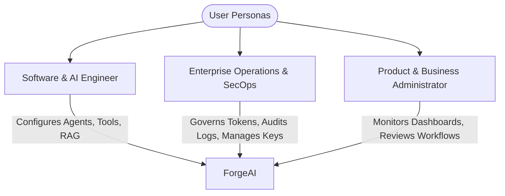

# 01. Product Vision & Strategy

## Executive Summary

**ForgeAI** is an enterprise-ready, modular AI agent orchestration platform designed to enable developers and enterprise teams to design, deploy, govern, and monitor autonomous AI agents, multi-agent workflows, and RAG knowledge pipelines with strict reliability, safety, and performance.

By combining the robustness of **Laravel 13**, the streaming reactivity of **Inertia.js v3 + Vue 3**, and the multi-provider capabilities of **`laravel/ai` SDK**, ForgeAI provides a single platform to bridge developer ergonomics with production-grade AI governance.

---

## 🎯 Strategic Goals

1. **Enterprise Agent Orchestration**: Enable deterministic, observable, and multi-step AI agent workflows with tool calling, human-in-the-loop approvals, and provider failover.
2. **Unified AI Infrastructure**: Standardize integration with LLM providers (OpenAI, Anthropic, Gemini, DeepSeek, local Ollama models) using a resilient abstraction layer.
3. **Sub-Second Reactive Experience**: Deliver real-time SSE streaming for agent reasoning, token generation, and workspace updates with Inertia v3.
4. **Token Cost & Governance Discipline**: Provide multi-tenant token quota budgeting, rate limiting, and real-time ledger tracking to prevent runaway LLM costs.
5. **Zero-Trust Security & Safety**: Enforce strict tool sandboxing, indirect prompt injection shields, and WebAuthn/Passkey authentication.

---

## 👥 User Personas & Target Use Cases

### Persona 1: Software & AI Engineer
* **Needs**: Rapidly build autonomous agents with typed custom tools, stateful memory, and vectorized knowledge bases without wrangling fragmented SDKs.
* **Key Tasks**: Writing PHP tool plugins, tuning system prompts, debugging agent execution traces, running Pest evals.

### Persona 2: SecOps & Infrastructure Lead
* **Needs**: Full auditability over external AI API key access, tool permissions, vector data isolation, and real-time usage monitoring.
* **Key Tasks**: Setting token budgets, reviewing prompt injection security logs, managing role-based access control (RBAC).

### Persona 3: Product Administrator
* **Needs**: Intuitive visual workspace to inspect agent performance, review token cost trends, and intervene in workflows requiring human authorization.
* **Key Tasks**: Approving high-consequence agent actions (e.g. external database mutations), viewing ROI metrics.

---

## ⚡ Non-Functional Requirements (NFR Matrix)

| Domain | Target Specification | Enforcement Mechanism |
|---|---|---|
| **Latency (TTFT)** | Time-To-First-Token < 400ms for streaming responses | Streaming Server-Sent Events (SSE) via `laravel/ai` and Inertia v3 |
| **Availability** | 99.9% uptime for core agent execution APIs | Multi-provider AI failover policies (e.g., Anthropic -> OpenAI fallback) |
| **Scale & Concurrency** | 10,000+ concurrent asynchronous tool execution jobs | Laravel Queue workers (Horizon/Redis) with dedicated execution queues |
| **Data Isolation** | Strict multi-tenant data separation (Logical & Vector) | Tenant-scoped database queries and vector namespace partitioning |
| **Auditability** | 100% trace log retention for prompt/completion pairs and tool outputs | Immutable audit ledger with PII redaction filters |

---

## 🔄 Design Rationale & Alternatives Considered

### Option A: Fully Decoupled Node.js / Python Fast-API microservices + SPA
* **Pros**: Native Python ML ecosystem compatibility.
* **Cons**: Fragmented codebases, duplicate domain logic, complex operational overhead, loss of unified authentication and database transactional boundary.

### Option B (Selected): Event-Driven Modular Monolith on Laravel 13 + Inertia v3
* **Pros**: Single deployment footprint, type-safe route functions via Wayfinder, rich first-party ecosystem (`laravel/ai`, Fortify, Pint, Pest), low operational overhead, rapid feature velocity.
* **Cons**: Requires explicit PHP execution sandboxing for custom code tools (mitigated via containerized/subprocess runners).

---

## ⚠️ Risks & Mitigations

| Identified Risk | Impact | Mitigation Strategy |
|---|---|---|
| **LLM Provider API Outage** | Critical | Implement `laravel/ai` dynamic provider failover across Gemini, OpenAI, Anthropic, and DeepSeek. |
| **Prompt Injection Attacks** | High | Implement input/output sanitization pipelines, tool approval gates, and structural prompt framing. |
| **Unbounded LLM Cost Spikes** | High | Enforce pre-execution token budget validation, tenant rate limits, and circuit breakers. |

---

## 🔗 Related Architecture Documents

- [02. Software Architecture Blueprint](file:///home/tristan/Projects/Forge_AI/docs/02-software-architecture-blueprint.md)
- [03. AI & Agent Framework Architecture](file:///home/tristan/Projects/Forge_AI/docs/03-ai-and-agent-framework.md)
- [06. Security Architecture & Threat Model](file:///home/tristan/Projects/Forge_AI/docs/06-security-architecture.md)
