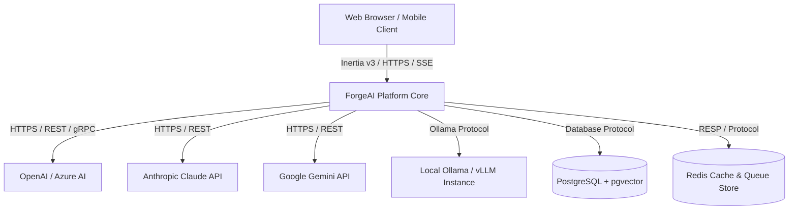
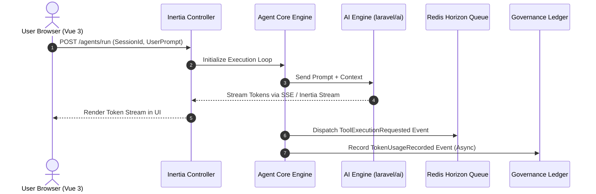

# 02. Software Architecture Blueprint

## Executive Summary

ForgeAI is architected as an **Event-Driven Modular Monolith** built on **Laravel 13 (PHP 8.5)** and **Inertia.js v3 + Vue 3**.

This topology yields maximum developer velocity, strict domain boundaries, low operational complexity, and seamless reactivity while keeping sub-components (AI Engine, Vector Pipeline, Tool Runners) modular enough to scale independently or extract into distinct microservices if future load demands it.

---

## 🏛️ System Architecture Topology (C4 Model)

### Level 1: System Context Diagram



---

### Level 2: Container Architecture Diagram

```mermaid
graph TB
    subgraph Client Layer
        VueApp[Vue 3 SPA + Inertia v3 Engine]
    end

    subgraph Application Server Layer (Laravel 13 Monolith)
        Router[Wayfinder / Route Dispatcher]
        InertiaBridge[Inertia Server Controller Layer]

        subgraph Modules
            AuthMod[Auth & Tenant Module]
            AgentMod[Agent Core Module]
            AIMod[AI Engine Module - laravel/ai]
            VectorMod[Knowledge & Vector Module]
            WorkflowMod[Automation & Workflow Module]
            AuditMod[Audit & Token Governance Module]
        end
    end

    subgraph Asynchronous Execution Layer
        WorkerQueue[Laravel Horizon Queue Workers]
        ToolRunner[Isolated Tool Sandboxes / Process Runners]
    end

    subgraph Storage Layer
        DB[(PostgreSQL / SQLite + pgvector)]
        Cache[(Redis Cache / Lock Manager)]
    end

    VueApp <--> Router
    Router --> InertiaBridge
    InertiaBridge --> AuthMod
    InertiaBridge --> AgentMod
    AgentMod --> AIMod
    AgentMod --> VectorMod
    AgentMod --> WorkflowMod
    WorkflowMod --> WorkerQueue
    WorkerQueue --> ToolRunner
    AIMod --> AuditMod
    AgentMod --> DB
    AIMod --> Cache
```

---

## 📦 Modular Monolith Domain Boundaries

ForgeAI enforces strict directory and architectural scoping inside `app/Modules/` (or structured domain namespaces under `app/Domain/`):

```
app/
├── Domain/
│   ├── AuthTenant/          # User authentication, Teams, Organization scopes, Fortify actions
│   ├── Agent/               # Agent definitions, System prompts, Memory buffers, State machines
│   ├── AIEngine/            # Abstraction around laravel/ai, provider policies, streaming handlers
│   ├── KnowledgeVector/     # Document chunking, Embeddings, Vector storage adapters, RAG search
│   ├── Automation/          # Tool definitions, Execution sandboxes, Workflow graphs
│   └── Governance/          # Token ledgers, Rate limiters, Security sanitization, Audit logs
```

### Module Responsibilities & Boundary Rules

1. **Auth & Tenant Module (`Domain/AuthTenant`)**
   - Manages user identity, passkey authentication, organization workspace isolation, and RBAC permissions.
   - *Rule*: All queries in other modules MUST accept a `TenantId` context.

2. **Agent Core Module (`Domain/Agent`)**
   - Manages Agent configuration, model selection, temperature/top_p parameters, conversation sessions, and context history composition.

3. **AI Engine Module (`Domain/AIEngine`)**
   - Serves as the dedicated adapter wrapping the `Laravel\Ai` namespace. Handles prompt execution, structured JSON output generation, SSE streaming pipelines, and multi-provider failover.

4. **Knowledge & Vector Module (`Domain/KnowledgeVector`)**
   - Manages data ingestion pipelines (PDFs, Markdown, Web pages), text chunking strategies, vector embedding generation, and pgvector cosine similarity queries.

5. **Automation & Workflow Module (`Domain/Automation`)**
   - Orchestrates agent tool calling (e.g. web scraping, SQL querying, external API calls), handles human-in-the-loop permission requests, and manages background job queues.

6. **Audit & Token Governance Module (`Domain/Governance`)**
   - Intercepts all AI provider requests/responses to calculate token usage, charge tenant ledger balances, record prompt/completion hashes, and enforce cost circuit breakers.

---

## ⚡ Synchronous vs. Asynchronous Communication Rules



1. **Direct UI Interactions (Synchronous / SSE)**: User prompt submissions, instant agent message streams, form updates, and UI navigations use Inertia v3 actions with server-sent events for sub-second streaming.
2. **Heavy Execution (Asynchronous Jobs)**: Document chunking, vector embedding indexing, complex multi-step tool executions, and bulk evals run exclusively on Redis-backed Laravel Queue workers.
3. **Cross-Module Decoupling (Domain Events)**: Modules NEVER directly invoke write methods in other modules. They dispatch typed Domain Events (e.g. `AgentExecutionCompleted`, `TokenLimitReached`).

---

## 📊 Trade-Off Matrix & Architectural Rationale

| Consideration | Microservices Architecture | Modular Monolith (Chosen) |
|---|---|---|
| **Development Velocity** | Low (Distributed setup, network RPCs, versioning overhead) | **Extremely High** (Single repo, direct PHP calls, zero RPC lag) |
| **Operational Overhead** | High (Kubernetes, mesh routing, distributed tracing) | **Low** (Single container image / standard PHP worker topology) |
| **Domain Boundary Enforcement** | Enforced by network interfaces | Enforced by static analysis (Larastan) and PHP namespaces |
| **Extractability** | N/A | High (Modules are cleanly separated for future microservice extraction if needed) |

---

## 🔗 Related Architecture Documents

- [01. Product Vision & Strategy](file:///home/tristan/Projects/Forge_AI/docs/01-product-vision.md)
- [03. AI & Agent Framework Architecture](file:///home/tristan/Projects/Forge_AI/docs/03-ai-and-agent-framework.md)
- [04. Domain Model & Logical Database Design](file:///home/tristan/Projects/Forge_AI/docs/04-domain-model-and-database-design.md)
- [ADR-0003: Event-Driven Modular Monolith Architecture](file:///home/tristan/Projects/Forge_AI/docs/adrs/0003-event-driven-modular-monolith-architecture.md)
