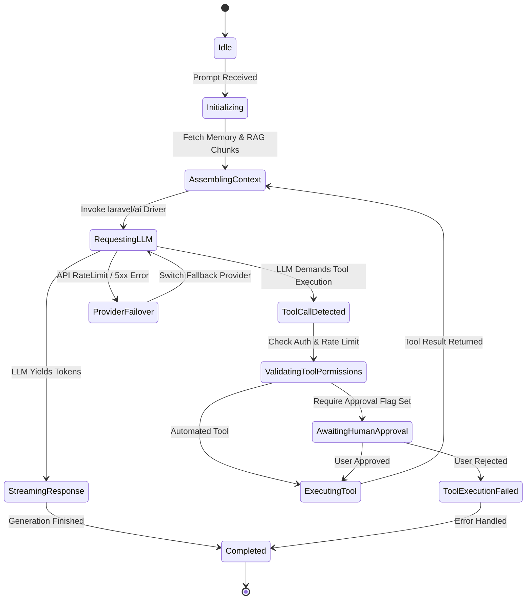
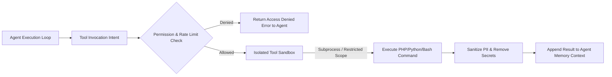
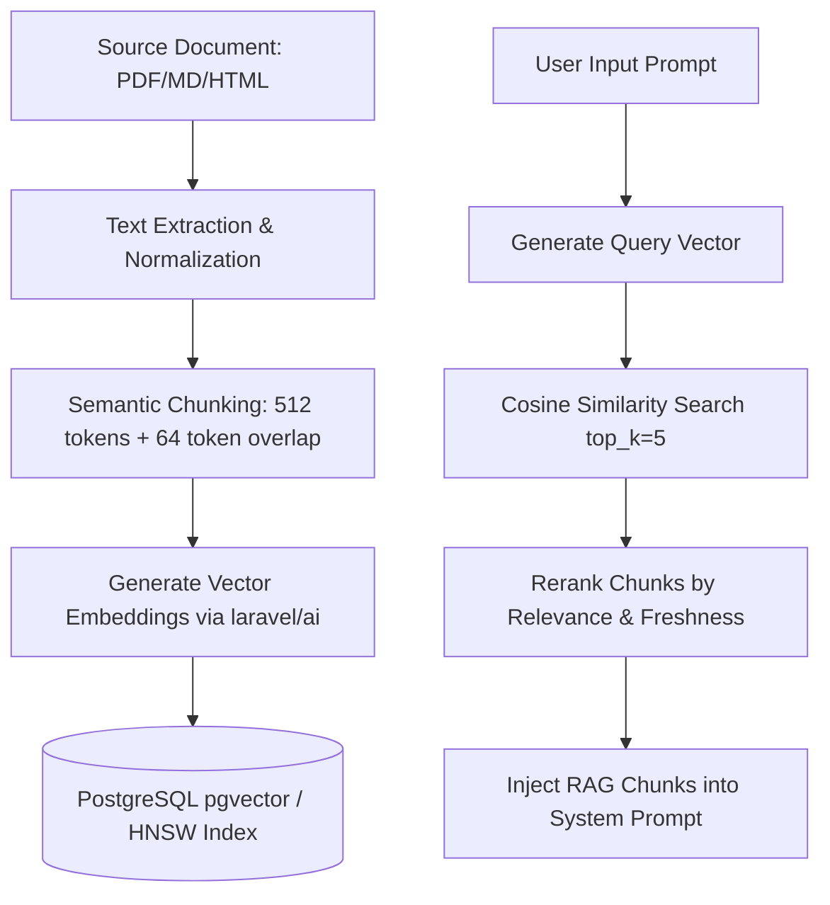

# 03. AI & Agent Framework Architecture

## Executive Summary

The **ForgeAI AI & Agent Framework** serves as the core intelligence engine of the platform.

It is built directly on top of the first-party **`laravel/ai` SDK** (`Laravel\Ai\*`), extending it with multi-agent orchestration, dynamic tool invocation sandboxing, multi-provider automatic failover, context window memory compaction, and a RAG vector retrieval pipeline.

---

## 🧠 Core Architecture & `laravel/ai` SDK Integration

ForgeAI abstracts all LLM interactions through the `AIEngineModule`. Rather than writing raw HTTP calls or fragmented third-party vendor clients, all model prompts, completion requests, embeddings, and structured outputs flow through standardized `laravel/ai` abstractions.

```mermaid
graph TD
    subgraph ForgeAI Agent Framework
        AgentRunner[Agent Execution Loop]
        ContextComposer[Context & Memory Manager]
        ToolRegistry[Tool Registry & Permission Checker]
    end

    subgraph Laravel AI SDK (laravel/ai)
        AiFacade[Laravel\Ai\Ai Gateway]
        PromptBuilder[Prompt & System Instruction Builder]
        StructuredOutput[Structured JSON Schema Parser]
    end

    subgraph Multi-Provider Driver Layer
        OpenAiDriver[OpenAI Driver]
        AnthropicDriver[Anthropic Driver]
        GeminiDriver[Google Gemini Driver]
        LocalDriver[Ollama / vLLM Driver]
    end

    AgentRunner --> ContextComposer
    AgentRunner --> ToolRegistry
    AgentRunner --> AiFacade
    AiFacade --> PromptBuilder
    AiFacade --> StructuredOutput
    AiFacade --> OpenAiDriver
    AiFacade --> AnthropicDriver
    AiFacade --> GeminiDriver
    AiFacade --> LocalDriver
```

---

## 🤖 Agent Lifecycle State Machine

An agent execution step in ForgeAI transitions through a deterministic state machine to ensure full observability and error recovery:



---

## 🛡️ Multi-Provider Strategy & Automated Failover Circuit Breakers

To guarantee enterprise 99.9% uptime, ForgeAI implements an automated provider circuit breaker and fallback cascade strategy managed inside `AIEngineModule`:

```php
// Conceptual Failover Pipeline Topology
$response = Ai::agent()
    ->withProviderCascade([
        'anthropic:claude-3-5-sonnet',
        'openai:gpt-4o',
        'gemini:gemini-1.5-pro',
    ])
    ->withRetry(attempts: 3, backoffMs: 200)
    ->prompt($assembledContext);
```

### Failover Rules:
1. **Transient Errors (HTTP 429, 502, 503, Timeout)**: Trigger immediate retries with exponential jitter backoff before falling back to the secondary provider.
2. **Hard Errors (HTTP 400 Bad Prompt, Invalid Tool Signature)**: Instantly fail fast and log diagnostic trace to avoid wasting fallback API costs.
3. **Cost & Token Quota Exceeded**: Trigger fallback to lower-cost models (e.g. `gpt-4o-mini` or `gemini-1.5-flash`) if configured by the tenant's policy.

---

## 🛠️ Dynamic Tool Execution & Sandboxing Architecture

Tools in ForgeAI allow agents to interact with external systems (e.g., executing code, running SQL queries, reading external APIs).



### Tool Safety Guarantees:
- **Parameter Validation**: Every tool defines a strict JSON Schema validated via `laravel/ai` before invocation.
- **Human-in-the-Loop (HITL)**: High-consequence tools (e.g., `DeleteDatabaseRecord`, `SendExternalEmail`) require explicit approval from the user via the Vue 3 frontend before execution proceeds.
- **Timeouts & Memory Constraints**: Tools execute under rigid process memory caps (e.g. 128MB) and hard execution wall-clock limits (e.g. 10s).

---

## 📚 Vector RAG & Knowledge Indexing Pipeline

ForgeAI incorporates a full RAG (Retrieval-Augmented Generation) pipeline for context ingestion and semantic vector retrieval:



---

## 📺 Real-Time Streaming Architecture (Inertia v3 + SSE)

ForgeAI delivers real-time token generation and agent status updates directly to the Vue 3 user interface without requiring complex WebSockets infrastructure:

1. **Server-Sent Events (SSE)**: The Inertia v3 frontend connects to an SSE endpoint (`/agents/sessions/{session}/stream`).
2. **Chunked Response Handler**: As `laravel/ai` yields token chunks from OpenAI/Anthropic, the server flushes text chunks directly to the HTTP response stream.
3. **Optimistic Vue State**: The Vue 3 client appends incoming chunks immediately to the active conversation component, providing smooth, typing-style reactivity.

---

## 🔗 Related Architecture Documents

- [02. Software Architecture Blueprint](file:///home/tristan/Projects/Forge_AI/docs/02-software-architecture-blueprint.md)
- [04. Domain Model & Logical Database Design](file:///home/tristan/Projects/Forge_AI/docs/04-domain-model-and-database-design.md)
- [06. Security Architecture & Threat Model](file:///home/tristan/Projects/Forge_AI/docs/06-security-architecture.md)
- [ADR-0002: Standardizing AI Engine on First-Party laravel/ai SDK](file:///home/tristan/Projects/Forge_AI/docs/adrs/0002-ai-framework-laravel-ai-sdk.md)
