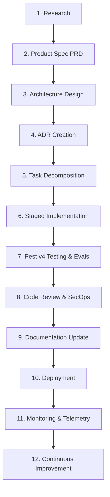

# 03. End-to-End Development Workflow Lifecycle

## Executive Summary

The **ForgeAI Development Workflow** defines the canonical 12-stage lifecycle for every feature, enhancement, or bug fix introduced to the platform.

Whether initiated by a human product lead or an autonomous AI Project Manager Agent, work MUST progress sequentially through all 12 stages with explicit quality gates at every transition.

---

## 🔄 12-Stage Development Lifecycle Map

---

## 📑 Lifecycle Stage Specifications

### Stage 1: Research & Discovery
- **Purpose**: Investigate user requirements, industry practices, and existing codebase dependencies.
- **Inputs**: User feedback, feature request, production incident report.
- **Outputs**: Technical research notes, technology comparison matrix.
- **Approval Gate**: Product Manager / Lead Architect review.

### Stage 2: Product Specification (PRD)
- **Purpose**: Define problem statement, target personas, functional/NFR requirements, and acceptance criteria.
- **Inputs**: Stage 1 research notes.
- **Outputs**: Feature specification document adhering to `docs/12-feature-specifications.md`.
- **Approval Gate**: Product Lead sign-off.

### Stage 3: Architecture Design
- **Purpose**: Define DDD context boundaries, domain aggregates, database entities, and sequence flows.
- **Inputs**: Stage 2 PRD.
- **Outputs**: C4 diagrams, sequence charts, schema additions.
- **Approval Gate**: Principal Architect approval.

### Stage 4: Architecture Decision Record (ADR) Creation
- **Purpose**: Formally record significant technical decisions, options considered, trade-offs, and consequences.
- **Inputs**: Stage 3 Architecture Design.
- **Outputs**: New ADR document saved in `docs/adrs/`.
- **Quality Check**: Validated against `docs/01-forgeai-constitution.md`.

### Stage 5: Task Decomposition & Backlog Refinement
- **Purpose**: Break feature specs down into Epics, Stories, and discrete Tasks.
- **Inputs**: Stage 2 PRD, Stage 3 Architecture.
- **Outputs**: Backlog tasks with Gherkin acceptance criteria in GitHub Issues.
- **Approval Gate**: Project Manager Agent / Engineering Lead assignment.

### Stage 6: Implementation
- **Purpose**: Write backend PHP code, Vue 3 components, and database migrations.
- **Inputs**: Stage 5 task specifications.
- **Outputs**: Staged code changes adhering to `docs/02-engineering-standards.md`.
- **Quality Check**: Automated `pint` formatting and `larastan` Level 8 static analysis pass.

### Stage 7: Automated Testing & LLM Evals
- **Purpose**: Verify functional correctness, architectural boundaries, and AI prompt accuracy.
- **Inputs**: Stage 6 code changes.
- **Outputs**: Passing Pest v4 unit, feature, arch, and eval test runs.
- **Quality Check**: `php artisan test --compact` yields 100% pass rate.

### Stage 8: Code Review & SecOps Inspection
- **Purpose**: Audit code for security vulnerabilities, PII leaks, and adherence to DDD module isolation.
- **Inputs**: Pull Request with passing CI tests.
- **Outputs**: Peer / Agent code review comments and approval stamp.
- **Approval Gate**: Minimum 1 Lead Engineer + Security Architect sign-off.

### Stage 9: Documentation Synchronization
- **Purpose**: Update architecture blueprints, API catalogues, and user manuals to reflect changes.
- **Inputs**: Merged Pull Request.
- **Outputs**: Updated documents in `/docs` and `AGENTS.md`.

### Stage 10: Staged Deployment
- **Purpose**: Deploy built container assets to staging/production via Docker and FrankenPHP.
- **Inputs**: Merged main branch release tag.
- **Outputs**: Live deployed environment.
- **Quality Check**: Automated zero-downtime deployment script execution.

### Stage 11: Real-Time Monitoring & Telemetry
- **Purpose**: Track production performance, TTFT latencies, queue depths, and token ledgers.
- **Inputs**: Live production traffic.
- **Outputs**: Pail log streams, Horizon dashboard metrics.

### Stage 12: Continuous Improvement & Feedback Loop
- **Purpose**: Feed telemetry insights back into product backlog for optimization.
- **Inputs**: Telemetry metrics, token cost ledgers, user feedback.
- **Outputs**: Retrospective action items, new feature research tasks.

---

## 🔗 Related Architecture Documents

- [01-forgeai-constitution.md](file:///home/tristan/Projects/Forge_AI/docs/01-forgeai-constitution.md)
- [02-engineering-standards.md](file:///home/tristan/Projects/Forge_AI/docs/02-engineering-standards.md)
- [04-git-workflow.md](file:///home/tristan/Projects/Forge_AI/docs/04-git-workflow.md)
- [05-definition-of-done.md](file:///home/tristan/Projects/Forge_AI/docs/05-definition-of-done.md)
