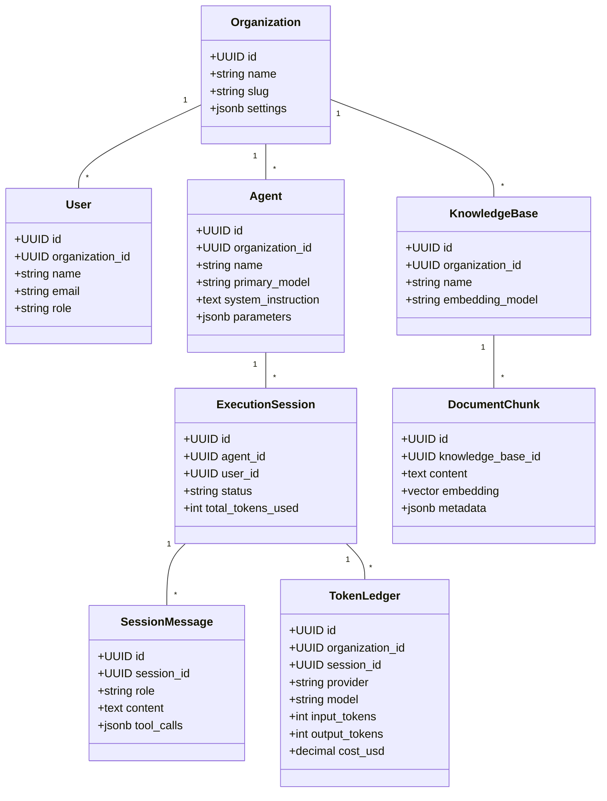

# 04. Domain Model & Logical Database Design

## Executive Summary

The ForgeAI domain model is designed around Domain-Driven Design (DDD) principles. It cleanly isolates core entities across 5 key bounded contexts: **Tenant Governance**, **Agent Orchestration**, **Knowledge & Vectors**, **Automation Tooling**, and **Token Audit Ledgers**.

The storage engine utilizes **PostgreSQL 16+** with the **`pgvector`** extension (with SQLite + sqlite-vector fallback support for local dev), ensuring transactional integrity alongside high-performance vector search.

---

## 🧩 Domain Bounded Contexts & Aggregates



---

## 🗄️ Logical Relational Database Schema

### 1. `organizations`
| Column | Type | Constraints | Description |
|---|---|---|---|
| `id` | UUID | Primary Key | Global unique identifier |
| `name` | VARCHAR(255) | NOT NULL | Organization / Company name |
| `slug` | VARCHAR(255) | UNIQUE, NOT NULL | URL-safe identifier |
| `monthly_token_budget` | BIGINT | DEFAULT 1,000,000 | Token cap ceiling |
| `created_at` / `updated_at` | TIMESTAMP | NOT NULL | Audit timestamps |

### 2. `agents`
| Column | Type | Constraints | Description |
|---|---|---|---|
| `id` | UUID | Primary Key | Agent identifier |
| `organization_id` | UUID | FK -> organizations(id) | Tenant owner |
| `name` | VARCHAR(255) | NOT NULL | Agent display name |
| `primary_model` | VARCHAR(100) | NOT NULL | e.g. `anthropic:claude-3-5-sonnet` |
| `fallback_model` | VARCHAR(100) | NULLable | Fallback model string |
| `system_instruction` | TEXT | NOT NULL | Base system prompt instructions |
| `temperature` | DECIMAL(3,2) | DEFAULT 0.70 | Creativity factor (0.0 to 2.0) |
| `is_active` | BOOLEAN | DEFAULT true | Operational state |

### 3. `execution_sessions`
| Column | Type | Constraints | Description |
|---|---|---|---|
| `id` | UUID | Primary Key | Session identifier |
| `agent_id` | UUID | FK -> agents(id) | Target agent |
| `user_id` | UUID | FK -> users(id) | Initiating user |
| `status` | VARCHAR(50) | NOT NULL | `active`, `paused_hitl`, `completed`, `failed` |
| `context_tokens_accumulated` | INTEGER | DEFAULT 0 | Current context token depth |

### 4. `session_messages`
| Column | Type | Constraints | Description |
|---|---|---|---|
| `id` | UUID | Primary Key | Message identifier |
| `session_id` | UUID | FK -> execution_sessions(id) | Session parent |
| `role` | VARCHAR(20) | NOT NULL | `system`, `user`, `assistant`, `tool` |
| `content` | TEXT | NULLable | Raw text content |
| `tool_calls` | JSONB | NULLable | Tool invocation metadata |
| `created_at` | TIMESTAMP | NOT NULL | Sequence timestamp |

---

## 🎯 Vector Search Schema & Indexing (`pgvector`)

```sql
-- Knowledge Chunk Storage Schema with HNSW Vector Indexing
CREATE EXTENSION IF NOT EXISTS vector;

CREATE TABLE document_chunks (
    id UUID PRIMARY KEY DEFAULT gen_random_uuid(),
    knowledge_base_id UUID NOT NULL REFERENCES knowledge_bases(id) ON DELETE CASCADE,
    document_id UUID NOT NULL REFERENCES documents(id) ON DELETE CASCADE,
    chunk_index INT NOT NULL,
    content TEXT NOT NULL,
    token_count INT NOT NULL,
    embedding vector(1536), -- Standard OpenAI/Gemini dimension depth
    metadata JSONB DEFAULT '{}'::jsonb,
    created_at TIMESTAMP WITH TIME ZONE DEFAULT CURRENT_TIMESTAMP
);

-- Cosine Distance HNSW Index for Sub-10ms Retrieval
CREATE INDEX idx_document_chunks_embedding_hnsw 
ON document_chunks 
USING hnsw (embedding vector_cosine_ops)
WITH (m = 16, ef_construction = 64);
```

---

## 💳 Token Usage & Financial Audit Ledger

To prevent data tampering and provide real-time budget enforcement, the `token_ledgers` table operates as an append-only transaction ledger:

```sql
CREATE TABLE token_ledgers (
    id UUID PRIMARY KEY DEFAULT gen_random_uuid(),
    organization_id UUID NOT NULL REFERENCES organizations(id),
    session_id UUID NULL REFERENCES execution_sessions(id),
    agent_id UUID NULL REFERENCES agents(id),
    provider VARCHAR(50) NOT NULL,    -- e.g. 'openai', 'anthropic'
    model VARCHAR(100) NOT NULL,     -- e.g. 'claude-3-5-sonnet'
    prompt_tokens INT NOT NULL,
    completion_tokens INT NOT NULL,
    estimated_cost_usd DECIMAL(12, 6) NOT NULL,
    created_at TIMESTAMP WITH TIME ZONE DEFAULT CURRENT_TIMESTAMP
);

CREATE INDEX idx_token_ledger_org_date ON token_ledgers(organization_id, created_at);
```

---

## 🔒 Multi-Tenant Query Scoping Strategy

1. **Global Eloquent Scope**: All tenant-owned models implement a `BelongsToTenant` trait that automatically appends `WHERE organization_id = ?` to all query builders.
2. **Vector Space Partitioning**: Similarity searches filter by `knowledge_base_id IN (SELECT id FROM knowledge_bases WHERE organization_id = ?)` prior to vector distance calculations.

---

## 🔗 Related Architecture Documents

- [02. Software Architecture Blueprint](file:///home/tristan/Projects/Forge_AI/docs/02-software-architecture-blueprint.md)
- [03. AI & Agent Framework Architecture](file:///home/tristan/Projects/Forge_AI/docs/03-ai-and-agent-framework.md)
- [05. API Strategy & Event Catalogue](file:///home/tristan/Projects/Forge_AI/docs/05-api-and-event-catalogue.md)
- [06. Security Architecture & Threat Model](file:///home/tristan/Projects/Forge_AI/docs/06-security-architecture.md)
