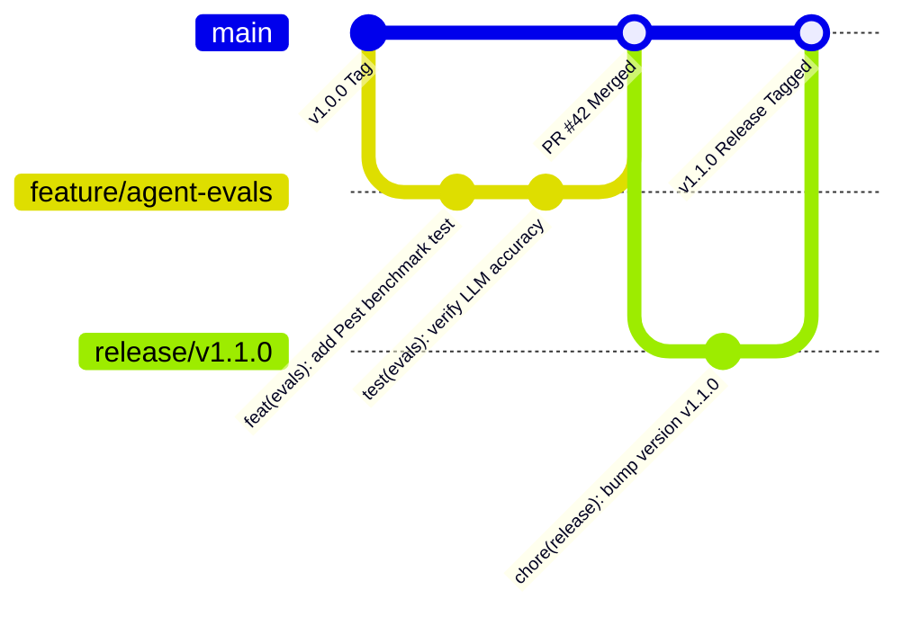
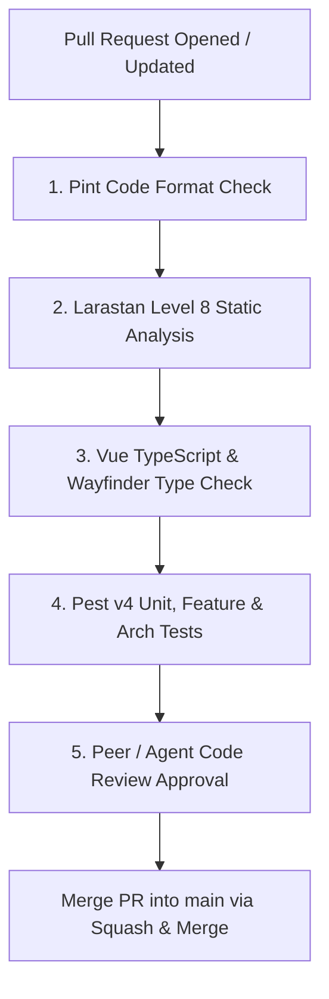

# 04. Git Workflow, Branching Strategy & Release Engineering

## Executive Summary

This document defines the Git branching model, commit conventions, Pull Request rules, semantic versioning policy, and release deployment strategy for **ForgeAI**.

Strict adherence to this workflow ensures code traceability, zero-downtime releases, and continuous integration stability.

---

## 🌳 Git Branching Model Strategy



### Branch Types & Naming Rules

| Branch Type | Naming Convention | Base Branch | Target Branch | Purpose |
|---|---|---|---|---|
| **Production Main** | `main` | N/A | N/A | Stable, production-ready codebase |
| **Feature Branch** | `feature/{issue-id}-{short-desc}` | `main` | `main` | New feature or capability implementation |
| **Bug Fix Branch** | `fix/{issue-id}-{short-desc}` | `main` | `main` | Standard bug fix or refactoring |
| **Release Branch** | `release/v{X.Y.Z}` | `main` | `main` | Staging testing and version release prep |
| **Hotfix Branch** | `hotfix/v{X.Y.Z}` | `main` | `main` | Emergency production patch |

---

## 📝 Commit Conventions (Conventional Commits)

Commit messages MUST strictly conform to the **Conventional Commits 1.0.0** specification:

$$\text{type}(\text{scope}):\ \text{short description in present imperative tense}$$

### Allowed Commit Types:
- `feat`: A new user-facing capability or API feature.
- `fix`: A bug fix or error resolution.
- `docs`: Documentation updates in `/docs` or inline comments.
- `style`: Formatting, missing semi-colons, Pint cleanup (no code change).
- `refactor`: Code restructuring without functional or API contract changes.
- `test`: Adding or modifying Pest unit, feature, arch, or eval tests.
- `chore`: Maintenance tasks, dependency updates, configuration tweaks.

---

## 🔀 Pull Request (PR) Requirements & Quality Gates

Every Pull Request MUST pass the automated CI quality pipeline before merging into `main`:



### Mandatory PR Quality Check Command:
```bash
composer run ci:check
```

---

## 📦 Semantic Versioning & Release Engineering

ForgeAI follows **Semantic Versioning 2.0.0 (`MAJOR.MINOR.PATCH`)**:
- **MAJOR**: Breaking API or architectural contract changes.
- **MINOR**: Backward-compatible new domain features or agent additions.
- **PATCH**: Backward-compatible bug fixes or security patches.

---

## 🔗 Related Architecture Documents

- [02-engineering-standards.md](file:///home/tristan/Projects/Forge_AI/docs/02-engineering-standards.md)
- [03-development-workflow.md](file:///home/tristan/Projects/Forge_AI/docs/03-development-workflow.md)
- [05-definition-of-done.md](file:///home/tristan/Projects/Forge_AI/docs/05-definition-of-done.md)
