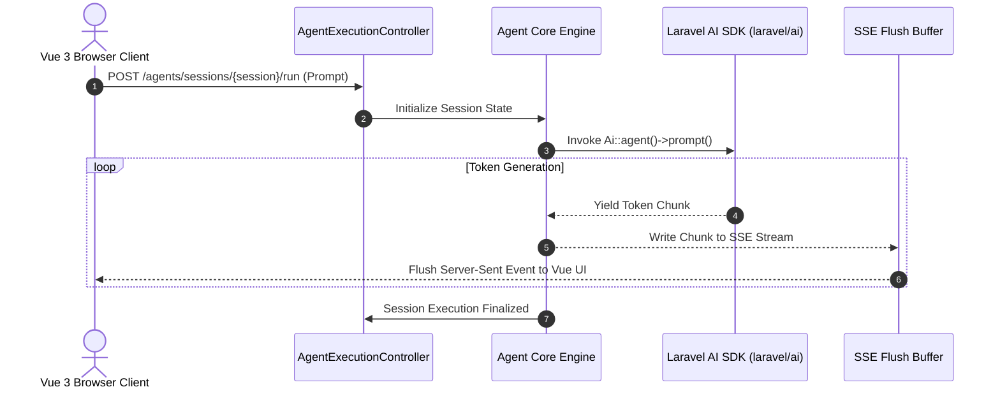

# 04. System Architecture Specification

## Executive Summary

This document specifies the end-to-end software architecture for **ForgeAI**.

It defines the system topology (C4 Model), module communication patterns, queue priority topologies, real-time streaming pipelines, and storage engines.

---

## 🏛️ High-Level System Architecture (C4 Container Diagram)

```mermaid
graph TB
    subgraph Client Layer
        Browser[Vue 3 SPA + Inertia v3 Engine]
        IdeClient[External IDE via MCP Protocol]
    end

    subgraph Edge & Ingress Layer
        WebGateway[FrankenPHP Application Ingress / Wayfinder Router]
    end

    subgraph Domain Module Layer (Modular Monolith)
        AuthMod[Domain/AuthTenant]
        AgentMod[Domain/Agent]
        AIMod[Domain/AIEngine (laravel/ai)]
        VectorMod[Domain/KnowledgeVector]
        AutoMod[Domain/Automation]
        GraphMod[Domain/EngineeringGraph]
        GovMod[Domain/Governance]
    end

    subgraph Asynchronous Infrastructure
        Horizon[Laravel Horizon Queue Controller]
        WorkerPool[Redis Worker Nodes]
        SandboxPool[Isolated Process Tool Sandboxes]
    end

    subgraph Persistence Engine
        Postgres[(PostgreSQL 16 + pgvector)]
        Redis[(Redis Cache & Event Bus)]
    end

    Browser <-->|HTTP / SSE Streaming| WebGateway
    IdeClient <-->|MCP Protocol / JSON-RPC| WebGateway
    WebGateway --> AuthMod
    WebGateway --> AgentMod
    AgentMod --> AIMod
    AgentMod --> VectorMod
    AgentMod --> AutoMod
    AgentMod --> GraphMod
    
    AutoMod --> Horizon
    Horizon --> WorkerPool
    WorkerPool --> SandboxPool
    
    AIMod --> GovMod
    GovMod --> Postgres
    VectorMod --> Postgres
    GraphMod --> Postgres
    Horizon --> Redis
```

---

## ⚡ Real-Time Streaming Architecture (Inertia v3 + SSE)



---

## 🚦 Queue Topology & Job Priority Matrix (Horizon)

All asynchronous workloads run on Redis queues managed by **Laravel Horizon**:

```
Redis Queue Topology
  ├── priority: critical       # Emergency circuit breakers, prompt injection alerts (10 workers)
  ├── priority: ai-inference    # LLM request dispatching & streaming aggregators (8 workers)
  ├── priority: tool-execution # Sandboxed tool runner jobs (isolated process workers) (6 workers)
  ├── priority: embeddings     # Document chunking & vector embedding generation (4 workers)
  └── priority: analytics      # Usage ledger writes, metric aggregations (2 workers)
```

---

## 🔍 Search & Storage Architecture

ForgeAI combines ACID relational storage, vector embedding similarity search, and PostgreSQL full-text search into a single **PostgreSQL 16** deployment:

```sql
-- Hybrid Vector Search & Relational Scoping Query Structure
SELECT 
    c.id,
    c.content,
    c.metadata,
    1 - (c.embedding <=> :queryEmbedding) AS similarity_score
FROM document_chunks c
JOIN knowledge_bases kb ON kb.id = c.knowledge_base_id
WHERE kb.organization_id = :tenantId
  AND c.embedding <=> :queryEmbedding < 0.30 -- Cosine Distance Cutoff
ORDER BY c.embedding <=> :queryEmbedding ASC
LIMIT 5;
```

---

## 🔗 Related Architecture Documents

- [02-domain-driven-design.md](file:///home/tristan/Projects/Forge_AI/docs/02-domain-driven-design.md)
- [05-modular-architecture.md](file:///home/tristan/Projects/Forge_AI/docs/05-modular-architecture.md)
- [06-engineering-graph.md](file:///home/tristan/Projects/Forge_AI/docs/06-engineering-graph.md)
- [09-api-strategy.md](file:///home/tristan/Projects/Forge_AI/docs/09-api-strategy.md)
