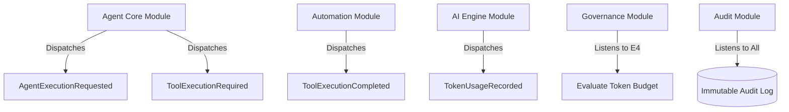
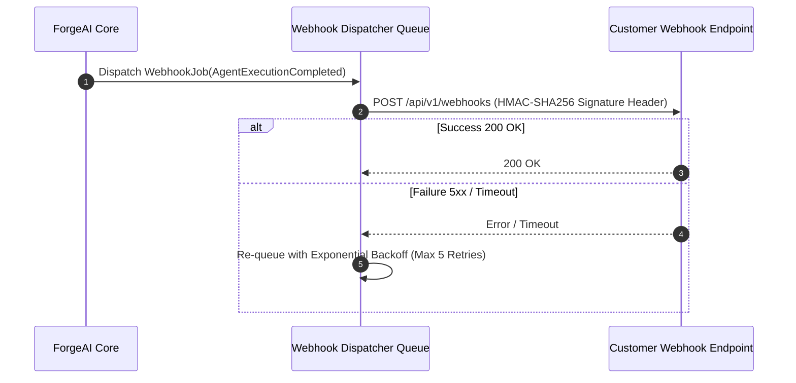

# 05. API Strategy & Event Catalogue

## Executive Summary

ForgeAI employs a dual API strategy:
1. **Internal Reactive API**: Powered by **Inertia.js v3** and **Laravel Wayfinder** (`@laravel/vite-plugin-wayfinder`), providing type-safe frontend-to-backend action dispatching with zero REST boilerplate.
2. **External REST & Webhook API**: Versioned RESTful endpoints and Server-Sent Event (SSE) streams for third-party integrations, external agents, and developer API keys.

In addition, an **Asynchronous Domain Event Catalogue** decouples core modules through Redis-backed queues.

---

## ⚡ Internal API: Inertia v3 + Wayfinder Contracts

Instead of manually maintaining hand-written API endpoints and TypeScript interfaces, ForgeAI uses Wayfinder to automatically generate typed TypeScript functions directly from Laravel Controller actions.

```typescript
// Example Vue 3 Frontend Invocation using Wayfinder typed route
import { runAgent } from '@/actions/AgentExecutionController';

const startExecution = async () => {
    await runAgent({
        session_id: session.id,
        prompt: userPrompt.value,
    });
};
```

---

## 📢 Domain Event Catalogue

Domain events allow modules to communicate asynchronously without hard coupled dependencies.



### Event Specifications

| Event Class | Payload Summary | Primary Consumers | Queue Priority |
|---|---|---|---|
| `AgentExecutionRequested` | `session_id`, `agent_id`, `prompt`, `user_id` | `AIEngineModule` | `critical` |
| `ToolExecutionRequired` | `session_id`, `tool_id`, `parameters`, `requires_hitl` | `AutomationModule` | `tool-execution` |
| `ToolExecutionCompleted` | `session_id`, `tool_id`, `output`, `status` | `AgentCoreModule` | `ai-inference` |
| `TokenUsageRecorded` | `org_id`, `session_id`, `provider`, `prompt_tokens`, `completion_tokens` | `GovernanceModule` | `analytics` |
| `PromptInjectionDetected` | `org_id`, `user_id`, `prompt_hash`, `risk_score` | `SecurityModule`, `AuditModule` | `critical` |
| `QuotaThresholdExceeded` | `org_id`, `percentage_used`, `current_budget` | `NotificationModule` | `default` |

---

## 🚦 Queue Topology & Priority Levels

ForgeAI uses **Laravel Horizon** backed by **Redis** to orchestrate job processing across dedicated queue workers:

```
[Redis Queues]
  ├── priority: critical       # Emergency circuit breakers, prompt injection alerts
  ├── priority: ai-inference    # LLM request dispatching & streaming aggregators
  ├── priority: tool-execution # Sandboxed tool runner jobs (isolated process workers)
  ├── priority: embeddings     # Document chunking & vector embedding generation
  └── priority: analytics      # Usage ledger writes, metric aggregations
```

---

## 🌐 External Webhook Engine Strategy

For enterprise integrations, external applications can register webhooks to receive real-time updates when agent sessions finish, tool actions fail, or human approvals are required.



### Webhook Security Standards:
- **HMAC-SHA256 Signatures**: Every payload includes an `X-ForgeAI-Signature` header computed using a tenant-specific webhook secret.
- **Replay Protection**: Payloads include an `X-ForgeAI-Timestamp` header. Receivers reject requests older than 300 seconds.

---

## 🔗 Related Architecture Documents

- [02. Software Architecture Blueprint](file:///home/tristan/Projects/Forge_AI/docs/02-software-architecture-blueprint.md)
- [03. AI & Agent Framework Architecture](file:///home/tristan/Projects/Forge_AI/docs/03-ai-and-agent-framework.md)
- [06. Security Architecture & Threat Model](file:///home/tristan/Projects/Forge_AI/docs/06-security-architecture.md)
