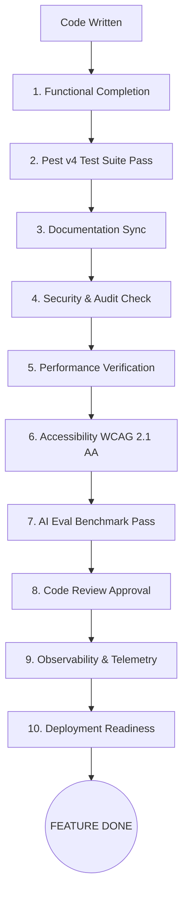

# 05. Definition of Done (DoD) Specification

## Executive Summary

The **Definition of Done (DoD)** is the mandatory checklist that every task, user story, and feature MUST complete before it is considered ready for merging and deployment.

No feature is "Done" simply because code is written. All 10 verification categories MUST pass.

---

## 🎯 Master Definition of Done Checklist

---

## 📋 10 Verification Categories

### 1. Functional Completion
- All Gherkin user stories and acceptance criteria defined in the feature spec are 100% satisfied.
- The user interface operates smoothly across responsive desktop and mobile viewports.

### 2. Automated Testing
- New domain logic is covered by Pest Unit tests (`tests/Unit/`).
- Controllers and API routes are covered by Pest Feature tests (`tests/Feature/`).
- Pest Architecture tests (`tests/Arch/`) pass with zero boundary violations.
- Full test suite passes via `php artisan test --compact`.

### 3. Documentation Synchronization
- Architecture documents in `/docs` are updated if module contracts, schemas, or events were modified.
- [AGENTS.md](file:///home/tristan/Projects/Forge_AI/AGENTS.md) is updated if new agent guidelines or skills were introduced.
- PHPDocs exist on all public PHP methods.

### 4. Security & Privacy Audit
- Tenant organization data isolation is strictly enforced via Eloquent scopes.
- Inputs and LLM completions pass through PII redaction and prompt injection filters.
- Tenant API keys are encrypted at rest using AES-256-GCM.

### 5. Performance Benchmarks
- Time-To-First-Token (TTFT) streaming responses render in < 400ms.
- Recursive graph CTE queries execute in < 15ms.
- Vector similarity searches execute in < 10ms.

### 6. Accessibility (WCAG 2.1 AA)
- Interactive elements possess unique `id` attributes and ARIA labels.
- Keyboard navigation (Tab, Enter, Escape) functions across all Vue UI modals and drawers.
- Color contrast meets WCAG 2.1 AA standards in both Light and Dark modes.

### 7. AI Evaluation Benchmark
- Prompts yield > 95% tool invocation accuracy against test eval datasets (`tests/Evals/`).
- Structured JSON outputs adhere strictly to target JSON Schemas.

### 8. Code Review Approval
- Code formatted cleanly via `vendor/bin/pint`.
- Static analysis passes `larastan` Level 8 with zero warnings.
- Approved by at least 1 Lead Engineer + 1 Security Architect.

### 9. Observability & Telemetry
- All domain events emit structured log payloads.
- Token consumption and USD costs log to `token_ledgers` append-only database table.

### 10. Deployment Readiness
- DB migrations execute cleanly and support backward-compatible rollbacks.
- Docker containers build and pass health check endpoints (`/up`).

---

## 🔗 Related Architecture Documents

- [01-forgeai-constitution.md](file:///home/tristan/Projects/Forge_AI/docs/01-forgeai-constitution.md)
- [02-engineering-standards.md](file:///home/tristan/Projects/Forge_AI/docs/02-engineering-standards.md)
- [03-development-workflow.md](file:///home/tristan/Projects/Forge_AI/docs/03-development-workflow.md)
- [04-git-workflow.md](file:///home/tristan/Projects/Forge_AI/docs/04-git-workflow.md)
