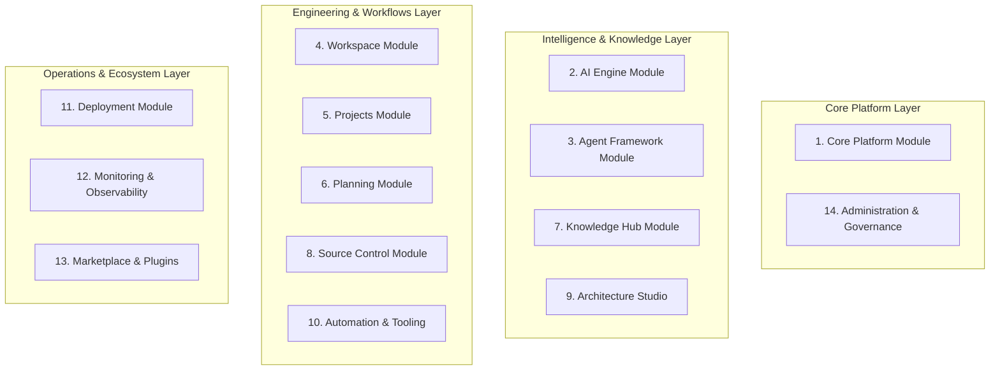

# 05. Modular Architecture Specification

## Executive Summary

ForgeAI's codebase is structured as a **Modular Monolith** under `app/Domain/`.

Each module maintains strict encapsulation, owning its domain logic, models, events, contracts, and internal services while communicating with other modules via typed interfaces and domain events.

---

## 📦 Master Module Catalogue (14 Core Modules)

---

## 🧩 Detailed Module Specifications

### 1. Core Platform Module (`app/Domain/CorePlatform`)
- **Responsibilities**: Organization multi-tenancy, user profiles, Fortify passkey auth, global middleware, configuration settings.
- **Data Ownership**: `organizations`, `users`, `passkey_credentials`, `user_preferences`.
- **Public Interface**: `CorePlatformContract::getTenantContext(string $tenantId): TenantContext`.
- **Domain Events**: `TenantCreated`, `UserAuthenticated`, `PasskeyRegistered`.

### 2. AI Engine Module (`app/Domain/AIEngine`)
- **Responsibilities**: Wraps `Laravel\Ai\*` SDK. Manages driver invocations (OpenAI, Anthropic, Gemini, Ollama, DeepSeek), structured JSON parsing, and streaming SSE responses.
- **Dependencies**: `CorePlatform`.
- **Public Interface**: `AIEngineContract::prompt(PromptPayload $payload): CompletionResponse`.
- **Domain Events**: `AICompletionRequested`, `AIProviderFailedOver`, `AITokenStreamYielded`.

### 3. Agent Framework Module (`app/Domain/Agent`)
- **Responsibilities**: Agent persona configuration, system instruction assembly, execution state machine, conversation history, context window trimming.
- **Dependencies**: `AIEngine`, `KnowledgeVector`, `Automation`.
- **Public Interface**: `AgentContract::runSession(string $sessionId, string $prompt): SessionResult`.
- **Domain Events**: `AgentExecutionRequested`, `AgentStateTransitioned`, `AgentExecutionCompleted`.

### 4. Workspace Module (`app/Domain/Workspace`)
- **Responsibilities**: User environment workspaces, session layout preferences, live collaboration state, real-time UI synchronization.
- **Data Ownership**: `workspaces`, `workspace_members`, `workspace_layouts`.
- **Dependencies**: `CorePlatform`.

### 5. Projects Module (`app/Domain/Projects`)
- **Responsibilities**: Software project aggregates, codebase repositories, tech stack settings, project environment secrets.
- **Data Ownership**: `projects`, `project_environments`, `project_integrations`.

### 6. Planning Module (`app/Domain/Planning`)
- **Responsibilities**: User stories, engineering tasks, feature roadmap milestones, sprint iterations, epic requirements tracking.
- **Data Ownership**: `epics`, `features`, `user_stories`, `sprint_iterations`.
- **Domain Events**: `FeatureDefined`, `SprintStarted`, `UserStoryStatusChanged`.

### 7. Knowledge Hub Module (`app/Domain/KnowledgeVector`)
- **Responsibilities**: Document parsing (PDF, MD, HTML), semantic text chunking, vector embedding generation, pgvector cosine search.
- **Data Ownership**: `knowledge_bases`, `documents`, `document_chunks`.
- **Public Interface**: `KnowledgeHubContract::searchSimilar(string $kbId, string $query, int $limit): Collection`.

### 8. Source Control Module (`app/Domain/SourceControl`)
- **Responsibilities**: Git repository index, commit logs, pull request management, branch strategies, code diff generation.
- **Data Ownership**: `git_repositories`, `commits`, `pull_requests`, `code_diffs`.

### 9. Architecture Studio Module (`app/Domain/ArchitectureStudio`)
- **Responsibilities**: Architectural Decision Records (ADRs), DDD Context Maps, C4 topology diagrams, boundary compliance checking.
- **Data Ownership**: `architectural_decision_records`, `domain_boundaries`, `c4_diagrams`.

### 10. Automation & Tooling Module (`app/Domain/Automation`)
- **Responsibilities**: Custom tool definitions, JSON Schema parameters, sandboxed execution runners, Human-in-the-Loop approval gates.
- **Data Ownership**: `tool_definitions`, `tool_executions`, `hitl_approval_requests`.
- **Public Interface**: `ToolRunnerContract::execute(string $toolId, array $args): ToolResult`.

### 11. Deployment Module (`app/Domain/Deployment`)
- **Responsibilities**: CI/CD pipeline triggers, release staging, deployment status tracking, container environment configurations.
- **Data Ownership**: `release_pipelines`, `deployments`, `environment_configs`.

### 12. Monitoring & Observability Module (`app/Domain/Monitoring`)
- **Responsibilities**: Telemetry tracking, production incident logging, error traces, agent evaluation benchmarks.
- **Data Ownership**: `telemetry_logs`, `production_incidents`, `eval_benchmarks`.

### 13. Marketplace & Plugins Module (`app/Domain/Marketplace`)
- **Responsibilities**: Extension plugin registry, third-party agent tools, community templates, plugin licensing.
- **Data Ownership**: `plugins`, `plugin_installations`, `plugin_permissions`.

### 14. Administration & Governance Module (`app/Domain/Governance`)
- **Responsibilities**: Token cost ledgers, tenant budget caps, RBAC policies, audit log streams, system health status.
- **Data Ownership**: `token_ledgers`, `tenant_budgets`, `audit_logs`, `rbac_policies`.

---

## 🔗 Related Architecture Documents

- [02-domain-driven-design.md](file:///home/tristan/Projects/Forge_AI/docs/02-domain-driven-design.md)
- [04-system-architecture.md](file:///home/tristan/Projects/Forge_AI/docs/04-system-architecture.md)
- [06-engineering-graph.md](file:///home/tristan/Projects/Forge_AI/docs/06-engineering-graph.md)
- [08-data-architecture.md](file:///home/tristan/Projects/Forge_AI/docs/08-data-architecture.md)
