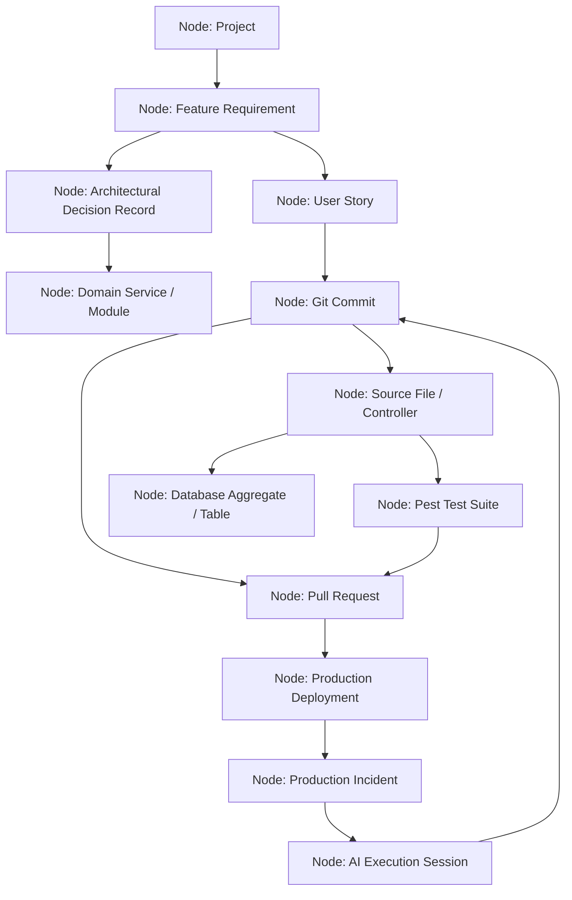

# 06. Engineering Graph Architecture & Reasoning Engine

## Executive Summary

The **Engineering Graph** is the core contextual engine of **ForgeAI**.

It constructs a connected property graph indexing every artifact in the software development ecosystem—connecting features, requirements, ADRs, source code commits, pull requests, test suites, database entities, deployments, incidents, and AI conversation sessions.

AI agents traverse this graph to ground their reasoning in exact, verified codebase relationships rather than guessing dependencies.

---

## 🕸️ Graph Ecosystem Topology & Node Relationships



---

## 📊 Node & Edge Schema Specification

### Graph Node Schema (`graph_nodes`)
| Column | Type | Index | Description |
|---|---|---|---|
| `id` | UUID | Primary Key | Node unique ID |
| `organization_id` | UUID | FK -> organizations | Multi-tenant scope |
| `node_type` | VARCHAR(50) | Indexed | e.g. `FEATURE`, `ADR`, `COMMIT`, `TEST`, `INCIDENT` |
| `entity_type` | VARCHAR(100) | Indexed | Target PHP class or table name |
| `entity_id` | UUID | Indexed | Foreign entity ID |
| `title` | VARCHAR(255) | NOT NULL | Display label |
| `properties` | JSONB | GIN Index | Metadata attributes, parameters, hashes |

### Graph Edge Schema (`graph_edges`)
| Column | Type | Index | Description |
|---|---|---|---|
| `id` | UUID | Primary Key | Edge unique ID |
| `source_node_id` | UUID | FK -> graph_nodes | Outgoing origin node |
| `target_node_id` | UUID | FK -> graph_nodes | Incoming destination node |
| `relationship_type` | VARCHAR(50) | Indexed | e.g. `IMPLEMENTS`, `TESTS`, `CAUSED_BY`, `BOUNDS` |
| `weight` | DECIMAL(3,2) | DEFAULT 1.0 | Relationship strength factor |
| `properties` | JSONB | GIN Index | Edge properties (creation timestamp, author) |

---

## 🧠 Recursive Graph Traversal Query Engine (PostgreSQL CTE)

AI agents execute recursive traversal queries to analyze impact before staging code changes or diagnosing incidents:

```sql
-- Recursive Impact Analysis Query: Find all tests, services, and docs affected by a Feature change
WITH RECURSIVE graph_traversal AS (
    -- Anchor Member: Target Feature Node
    SELECT id, node_type, title, entity_id, 1 AS depth
    FROM graph_nodes
    WHERE id = :targetFeatureNodeId AND organization_id = :tenantId

    UNION ALL

    -- Recursive Member: Traversal across directed edges
    SELECT n.id, n.node_type, n.title, n.entity_id, gt.depth + 1
    FROM graph_nodes n
    JOIN graph_edges e ON e.target_node_id = n.id
    JOIN graph_traversal gt ON gt.id = e.source_node_id
    WHERE gt.depth < 4 -- Traversal Depth Cap
)
SELECT DISTINCT node_type, title, entity_id, depth
FROM graph_traversal
ORDER BY depth ASC;
```

---

## 🤖 How AI Agents Reason Over the Engineering Graph

1. **Context Retrieval Before Code Generation**: Before editing a controller or service, an agent queries the graph for connected `ADR` and `FEATURE` nodes to ensure compliance with architectural specifications.
2. **Automated Impact Analysis**: When modifying a database entity, the agent traverses `BOUNDS` and `TESTS` edges to identify all affected Pest tests that must be updated and re-run.
3. **Root-Cause Incident Diagnosis**: During a production outage, the DevOps agent traverses `INCIDENT` -> `DEPLOYMENT` -> `PULL_REQUEST` -> `COMMIT` -> `AI_SESSION` to trace the exact line of code and reasoning that introduced the failure.

---

## 🔗 Related Architecture Documents

- [02-domain-driven-design.md](file:///home/tristan/Projects/Forge_AI/docs/02-domain-driven-design.md)
- [04-system-architecture.md](file:///home/tristan/Projects/Forge_AI/docs/04-system-architecture.md)
- [07-agent-framework.md](file:///home/tristan/Projects/Forge_AI/docs/07-agent-framework.md)
- [08-data-architecture.md](file:///home/tristan/Projects/Forge_AI/docs/08-data-architecture.md)
