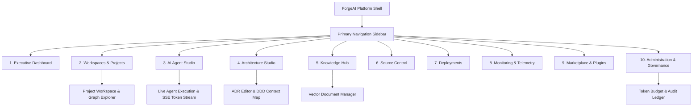

# 06. Information Architecture & UX Navigation

## Executive Summary

This document defines the **Information Architecture (IA)** and navigation hierarchy for **ForgeAI**.

The interface is designed as an interactive, single-page application (SPA) powered by **Inertia.js v3 + Vue 3**, providing sub-second reactivity, fluid modal drawers, and real-time streaming agent workspaces.

---

## 🗺️ Application Navigation Hierarchy

---

## 🖥️ Screen & Module Descriptions

### 1. Executive Dashboard (`/dashboard`)
- **Purpose**: Real-time overview of organization health, active agent sessions, token usage trends, and recent production releases.
- **Key Widgets**: Active Sessions Counter, Monthly Token Budget Progress Bar, Engineering Graph Activity Feed, Security Audit Highlights.

### 2. Workspaces & Projects (`/workspaces`, `/projects/{id}`)
- **Purpose**: Workspace container for repositories, codebase branches, user stories, and task backlogs.
- **Key Views**: Kanban Board, Backlog Tree, Engineering Graph Topology Viewer.

### 3. AI Agent Studio (`/agents`, `/agents/sessions/{id}`)
- **Purpose**: Primary workspace for orchestrating agent swarms, tuning system prompts, inspecting agent state transitions, and viewing streaming SSE token outputs.
- **Key Features**: Split-pane view (Left: Agent Chat & Thought Trace; Right: Staged Code Diff & Tool Output Drawer), HITL Approval Request Modals.

### 4. Architecture Studio (`/architecture`, `/architecture/adrs`)
- **Purpose**: Interactive studio for defining Architectural Decision Records (ADRs), inspecting DDD context boundaries, and verifying code compliance.
- **Key Views**: ADR Markdown Editor, Mermaid C4 Diagram Viewer, Domain Boundary Audit Matrix.

### 5. Knowledge Hub (`/knowledge`, `/knowledge/{id}`)
- **Purpose**: Manage data ingestion sources (PDFs, Markdown, Web documentation) and monitor vector embedding indexing health.
- **Key Views**: Document Indexer, Vector Chunk Search Tester, Ingestion Pipeline Status.

### 6. Source Control & Code Review (`/source-control`)
- **Purpose**: Inspect Git commits, pull requests, file diffs, and AI code review annotations.

### 7. Deployments & Pipelines (`/deployments`)
- **Purpose**: Track release pipelines, staging builds, container health checks, and deployment histories.

### 8. Monitoring & Telemetry (`/monitoring`)
- **Purpose**: Real-time telemetry monitoring, Pail log streams, Horizon queue worker metrics, and LLM eval benchmarks.

### 9. Marketplace & Extensions (`/marketplace`)
- **Purpose**: Discover, install, and configure third-party agent tools, community prompt templates, and Model Context Protocol (MCP) tool servers.

### 10. Administration & Governance (`/admin`)
- **Purpose**: Manage organization users, Fortify passkeys, RBAC policies, token budget caps, encrypted API keys, and immutable audit logs.

---

## 🔗 Related Architecture Documents

- [01-product-requirements.md](file:///home/tristan/Projects/Forge_AI/docs/01-product-requirements.md)
- [05-modular-architecture.md](file:///home/tristan/Projects/Forge_AI/docs/05-modular-architecture.md)
- [07-design-system-foundation.md](file:///home/tristan/Projects/Forge_AI/docs/07-design-system-foundation.md)
