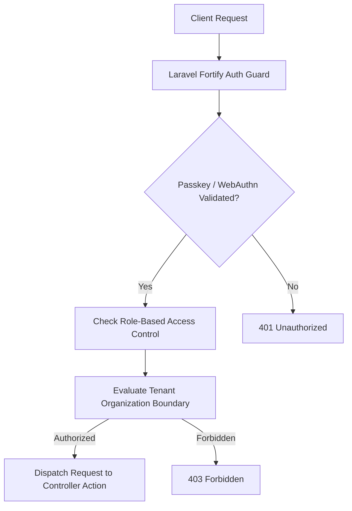
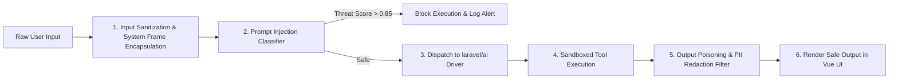

# 06. Security Architecture & Threat Model

## Executive Summary

Security in **ForgeAI** is architected around a **Zero-Trust Security Model** addressing both traditional web application vulnerabilities and specialized AI threat vectors (e.g., Indirect Prompt Injection, Tool Output Poisoning, LLM API Key Exfiltration).

The authentication core leverages **Laravel Fortify** combined with **WebAuthn / Passkeys** (`@laravel/passkeys`) and TOTP two-factor authentication.

---

## 🎯 STRIDE Threat Model & Defense Matrix

| Threat Category | Identified AI/Web Risk | Defense Mechanism in ForgeAI |
|---|---|---|
| **Spoofing** | Attacker impersonates legitimate user or unauthorized agent worker | Fortify authentication + WebAuthn/Passkeys, signed session cookies, Worker TLS certificates |
| **Tampering** | Attacker modifies system prompts, tool inputs, or RAG embeddings | Prompt framing encapsulation, cryptographic HMAC verification on vectors & webhooks |
| **Repudiation** | User denies initiating unauthorized tool action | Immutable audit ledgers (`token_ledgers`, `audit_logs`) recording user ID, IP, and prompt hash |
| **Information Disclosure** | LLM leaks tenant data or PII in completion output | Pre-execution PII redaction pipeline, tenant-scoped vector search isolation |
| **Denial of Service** | Runaway LLM queries exhaust token quota or flood API queues | Token budget circuit breakers, Redis rate limiters, queue execution timeouts |
| **Elevation of Privilege** | Agent tool escalates privileges to run unauthorized commands | Sandboxed tool execution, strict JSON schema validation, Human-in-the-Loop approvals |

---

## 🔑 Authentication & Access Control

### Authentication Stack Details:
- **Backend Authentication**: Managed by `laravel/fortify`, eliminating custom auth controller vulnerabilities.
- **Passkeys & WebAuthn**: Integrated via `@laravel/passkeys` for passwordless, phishing-resistant enterprise login.
- **Role-Based Access Control (RBAC)**:
  - `SuperAdmin`: Full system administration and platform configuration.
  - `OrganizationAdmin`: Manages tenant users, API keys, token budgets, and security policies.
  - `AgentDeveloper`: Creates agents, tools, prompt templates, and knowledge bases.
  - `AgentUser`: Executes agent sessions and interacts with RAG tools.

---

## 🛡️ AI Security & Prompt Injection Defense Engine

### Defense Mechanisms:
1. **System Instruction Isolation**: User inputs are strictly wrapped in delimiter boundaries (e.g. `<user_input>...</user_input>`) preventing user prompts from overwriting core system instructions.
2. **Indirect Prompt Injection Shield**: RAG document chunks and external web search outputs are treated as untrusted data and scanned for adversarial injection strings before being appended to the LLM context.
3. **Tool Input Validation**: LLM-generated tool parameter arguments are validated against strict JSON schema boundaries using PHP typing before execution.

---

## 🔒 Secrets Management for LLM API Keys

1. **Encryption at Rest**: External LLM API keys (OpenAI, Anthropic, Gemini) provided by tenants are encrypted in PostgreSQL using **AES-256-GCM** via Laravel's native Encrypter.
2. **Zero-Logging Policy**: Raw API keys and raw authorization bearer tokens are explicitly redacted from log files, stack traces, and `laravel/pail` / Boost streams.

---

## 🔗 Related Architecture Documents

- [02. Software Architecture Blueprint](file:///home/tristan/Projects/Forge_AI/docs/02-software-architecture-blueprint.md)
- [03. AI & Agent Framework Architecture](file:///home/tristan/Projects/Forge_AI/docs/03-ai-and-agent-framework.md)
- [05. API Strategy & Event Catalogue](file:///home/tristan/Projects/Forge_AI/docs/05-api-and-event-catalogue.md)
- [ADR-0001: Core Tech Stack](file:///home/tristan/Projects/Forge_AI/docs/adrs/0001-core-tech-stack-laravel13-inertia3-vue3.md)
