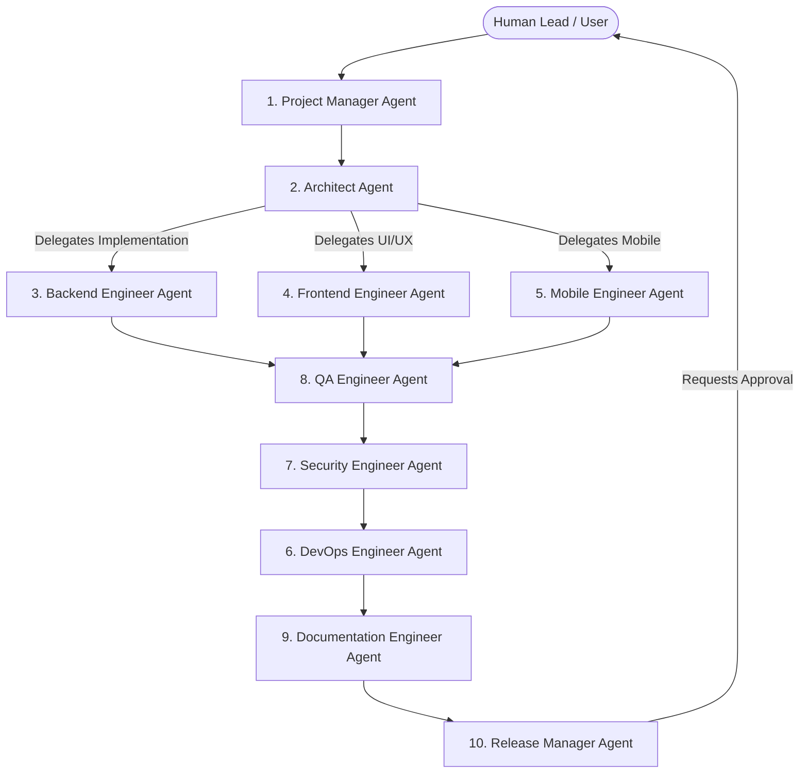
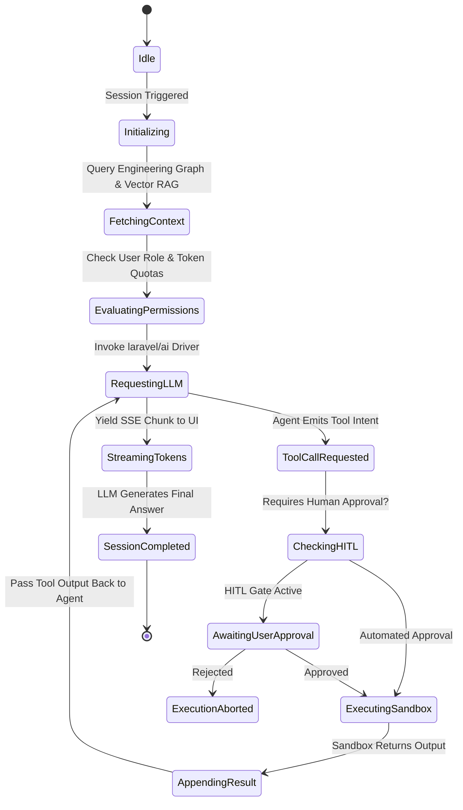

# 07. Collaborative Multi-Agent Framework Architecture

## Executive Summary

The **ForgeAI Agent Framework** manages autonomous, collaborative multi-agent swarms designed to perform software engineering tasks.

Built on the **`laravel/ai` SDK**, agents execute within deterministic state machines, sharing a unified memory context, executing sandboxed tools, and coordinating through a lead Architect / Project Manager orchestration pattern.

---

## 🤖 Built-in Specialist Agent Roster (10 Core Personas)

### Specialist Agent Specifications

1. **Project Manager Agent**: Decomposes feature requests into epics and user stories, assigns tasks to engineering agents, monitors token budgets, and tracks milestone progress.
2. **Architect Agent**: Enforces DDD domain boundaries, drafts ADRs, generates C4 diagrams, and verifies architectural alignment before code is written.
3. **Backend Engineer Agent**: Writes PHP 8.5 controllers, services, models, factories, and seeders following strict Laravel conventions.
4. **Frontend Engineer Agent**: Builds reactive Vue 3 components, Inertia v3 forms, Tailwind v4 styling, and Reka UI primitives.
5. **Mobile Engineer Agent**: Manages cross-platform API bindings, mobile-responsive viewports, and PWA capabilities.
6. **DevOps Engineer Agent**: Configures Docker topologies, FrankenPHP settings, Redis Horizon queues, CI/CD scripts, and deployment health checks.
7. **Security Engineer Agent**: Audits code for OWASP Top 10 vulnerabilities, validates prompt injection defense framing, checks passkey auth flows, and monitors secrets exposure.
8. **QA Engineer Agent**: Generates Pest v4 unit, feature, and architecture test suites; runs automated LLM evaluation harnesses.
9. **Documentation Engineer Agent**: Maintains `/docs` architecture files, API specifications, and inline PHPDocs without violating documentation policy.
10. **Release Manager Agent**: Orchestrates staging deployment approvals, tags Git releases, generates changelogs, and monitors production health post-release.

---

## 🔄 Agent Lifecycle State Machine

---

## 🔒 Shared Memory & Context Window Management

To prevent LLM context window exhaustion during long engineering sessions, ForgeAI implements a 3-tier memory management strategy:

1. **Sliding Message Window**: Keeps the most recent 10 turns in full raw detail.
2. **Semantic Context Compaction**: Automatically summarizes historical conversation turns older than 10 messages into a condensed structural summary using a lower-cost model (e.g. `gemini-1.5-flash`).
3. **Graph Memory Injection**: Replaces full historical code files in prompt memory with compact Graph Node URIs and diff patches.

---

## 🔗 Related Architecture Documents

- [02-domain-driven-design.md](file:///home/tristan/Projects/Forge_AI/docs/02-domain-driven-design.md)
- [03-ai-and-agent-framework.md](file:///home/tristan/Projects/Forge_AI/docs/03-ai-and-agent-framework.md)
- [06-engineering-graph.md](file:///home/tristan/Projects/Forge_AI/docs/06-engineering-graph.md)
- [10-security-architecture.md](file:///home/tristan/Projects/Forge_AI/docs/10-security-architecture.md)
