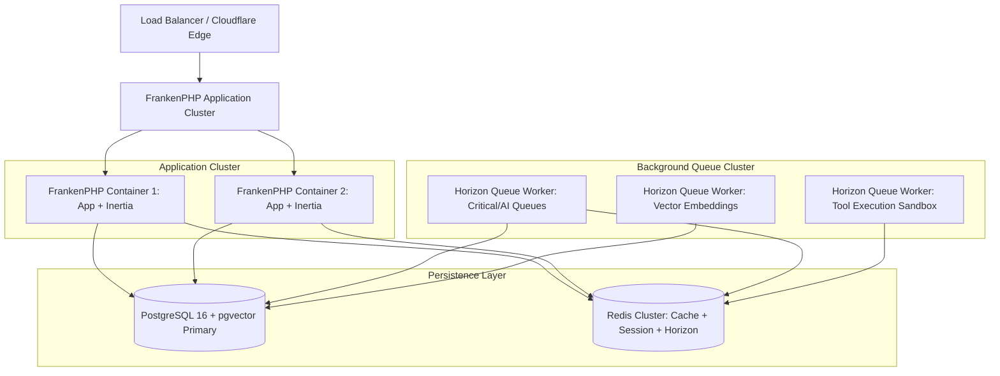
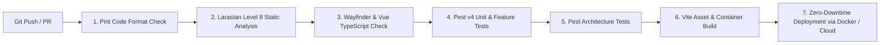

# 07. Deployment, Scaling & Testing Strategy

## Executive Summary

ForgeAI's infrastructure blueprint balances low operational overhead with high scalability.

The application deploys as a containerized stack (using **Docker**, **FrankenPHP / PHP 8.5**, **PostgreSQL + pgvector**, and **Redis**).

Testing follows a rigid **Pest v4** test pyramid, complemented by automated LLM evaluation harnesses to test prompt consistency and tool calling determinism.

---

## 🏗️ Production Container Topology



---

## 🧪 Testing Strategy Pyramid (Pest v4)

ForgeAI enforces automated quality control at every layer of the application using **Pest v4**:

```
        / \
       /   \        LLM Evals Harness (Prompt Accuracy & Determinism)
      / E2E \       Inertia E2E / Browser Smoke Tests
     /-------\
    / Feature \     Inertia Controller Actions, Auth & Tool Sandboxes
   /-----------\
  / Unit & Arch \   Domain Models, Services, PHP Architectural Rules
 /---------------\
```

### 1. Architectural Enforcement (`tests/ArchTest.php`)
```php
// Enforce strict layer separation
arch('domain modules do not leak into each other directly')
    ->expect('App\Domain\Agent')
    ->not->toUse('App\Domain\KnowledgeVector');

arch('controllers must extend BaseController')
    ->expect('App\Http\Controllers')
    ->toExtend('App\Http\Controllers\Controller');
```

### 2. Feature & Controller Tests (`tests/Feature/AgentExecutionTest.php`)
- Tests Inertia page renders, Wayfinder route dispatching, Fortify passkey authentication flows, and authorization gates.

### 3. LLM Quality Evaluation Harness (`tests/Evals/AgentEvalTest.php`)
- Runs automated evaluations on fixed prompt datasets to measure token accuracy, tool invocation precision, and system instruction compliance.

---

## 🚀 CI/CD Pipeline Workflow



### Continuous Integration Commands:
```bash
# Executed automatically in CI pipeline prior to deployment
composer run ci:check
```
This single script executes Pint checks, Larastan static analysis, Vue type checks, and the full Pest test suite.

---

## 📈 Observability & Log Telemetry

- **Real-time Tail Debugging**: Powered by `laravel/pail` for zero-overhead tailing of production log streams.
- **Queue Health**: Monitored via Laravel Horizon dashboards, alerting on job failure rates or queue latency spikes.
- **System Health Endpoints**: `/up` endpoint monitored for database connectivity, vector store health, and Redis availability.

---

## 🔗 Related Architecture Documents

- [02. Software Architecture Blueprint](file:///home/tristan/Projects/Forge_AI/docs/02-software-architecture-blueprint.md)
- [03. AI & Agent Framework Architecture](file:///home/tristan/Projects/Forge_AI/docs/03-ai-and-agent-framework.md)
- [05. API Strategy & Event Catalogue](file:///home/tristan/Projects/Forge_AI/docs/05-api-and-event-catalogue.md)
- [ADR-0003: Event-Driven Modular Monolith Architecture](file:///home/tristan/Projects/Forge_AI/docs/adrs/0003-event-driven-modular-monolith-architecture.md)
