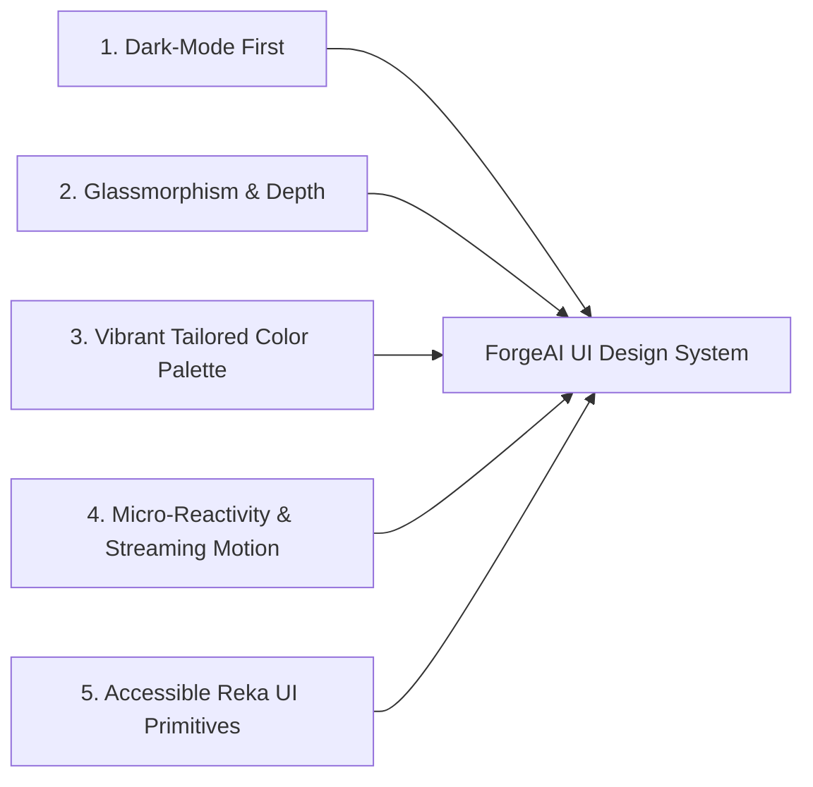

# 07. Design System Standards & Visual Philosophy

## Executive Summary

The **ForgeAI Design System** defines the aesthetic principles, color palettes, typography, spacing grids, component standards, accessibility guidelines, and motion effects for the platform's Vue 3 frontend.

Built on **Tailwind CSS v4** and **Reka UI**, the interface delivers a premium, dark-mode-first aesthetic with sub-second token streaming reactivity.

---

## 🎨 Design Philosophy & Aesthetic Pillars

1. **Dark-Mode First**: Built natively for software engineers working long hours. Uses rich obsidian/slate backgrounds with high-contrast text and vibrant status accents.
2. **Glassmorphism & Layered Depth**: Subtle semi-transparent panel backgrounds (`backdrop-blur-md bg-slate-900/80`) with refined 1px borders (`border-slate-800`).
3. **Vibrant Color Palette**: Tailored HSL color variables avoiding generic browser colors in favor of curated slate, violet, emerald, and amber highlights.
4. **Micro-Reactivity**: Typing-style token generation streams, pulsing state indicators, and smooth layout transitions via CSS animations (`tw-animate-css`).
5. **Accessible Reka UI Primitives**: Accessible modal dialogs, slide-over drawers, dropdown menus, and tabs provided by Reka UI (`reka-ui`).

---

## 🔤 Typography Specification

- **Primary UI Font Family**: `Inter`, `-apple-system`, `BlinkMacSystemFont`, `sans-serif`.
- **Code & Monospace Font Family**: `JetBrains Mono`, `Fira Code`, `monospace`.

| Scale | Size | Line Height | Weight | Usage |
|---|---|---|---|---|
| `text-xs` | 12px | 16px | 400 / 500 | Metadata, badge labels, timestamps |
| `text-sm` | 14px | 20px | 400 / 500 | Table cells, body copy, form inputs |
| `text-base` | 16px | 24px | 400 / 600 | Primary narrative, agent chat messages |
| `text-lg` | 18px | 28px | 600 | Card titles, section headers |
| `text-xl` | 20px | 28px | 700 | Modal titles, page headers |
| `text-2xl` | 24px | 32px | 700 | Dashboard stat callouts |

---

## 🎨 Color System (Tailwind CSS v4 HSL Tokens)

### Neutral Slate Palette
- **Background Deep (`bg-slate-950`)**: `#020617` — Main application shell background.
- **Surface Elevation 1 (`bg-slate-900`)**: `#0f172a` — Sidebar, cards, modal panels.
- **Surface Elevation 2 (`bg-slate-800`)**: `#1e293b` — Form inputs, hover states, active tabs.
- **Border Default (`border-slate-800`)**: `#1e293b` — Panel boundaries.

### Brand & Status Palette
- **Primary Indigo (`bg-indigo-600`)**: `#4f46e5` — Primary action buttons, active state indicators.
- **Agent Violet (`text-violet-400`)**: `#a78bfa` — AI thought traces, agent status badges.
- **Success Emerald (`text-emerald-400`)**: `#34d399` — Test pass indicators, 200 OK statuses.
- **Warning Amber (`text-amber-400`)**: `#fbbf24` — HITL approval pending, quota warnings.
- **Danger Rose (`text-rose-400`)**: `#fb7185` — Test failures, prompt injection blocks, 500 errors.

---

## ♿ Accessibility & Dark/Light Mode Compliance

1. **WCAG 2.1 AA Contrast**: All body text MUST maintain a minimum contrast ratio of 4.5:1 against panel backgrounds.
2. **Keyboard Focus Rings**: Interactive elements MUST render visible focus rings (`focus-visible:ring-2 focus-visible:ring-indigo-500`) when navigated via keyboard.
3. **Icons**: Provided exclusively by Lucide Vue (`@lucide/vue`). Decorative icons MUST include `aria-hidden="true"`.

---

## 🔗 Related Architecture Documents

- [02-engineering-standards.md](file:///home/tristan/Projects/Forge_AI/docs/02-engineering-standards.md)
- [06-information-architecture.md](file:///home/tristan/Projects/Forge_AI/docs/06-information-architecture.md)
