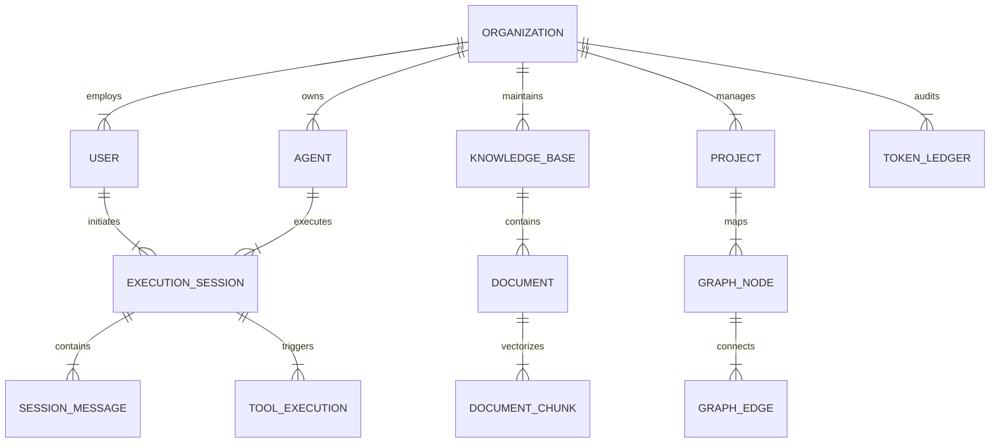

# 08. Data Architecture & Logical Entity Model

## Executive Summary

The **ForgeAI Data Architecture** defines the logical entity schemas, aggregate boundaries, multi-tenant query scoping policies, and storage engines for the platform.

All persistent storage resides in **PostgreSQL 16+** with the **`pgvector`** extension, providing transactional consistency for relational entities alongside high-speed vector embeddings.

---

## 🗄️ Master Aggregate & Entity Blueprint

---

## 📋 Logical Entity Specifications

### 1. Tenant & Core Identity Aggregates
- **`organizations`**: Root tenant boundary. Fields: `id` (UUID), `name`, `slug`, `monthly_token_budget` (BigInt), `created_at`, `updated_at`.
- **`users`**: Tenant user account. Fields: `id` (UUID), `organization_id` (FK), `name`, `email`, `role` (`SuperAdmin`, `OrgAdmin`, `Developer`, `User`), `created_at`, `updated_at`.
- **`passkey_credentials`**: WebAuthn credential metadata. Fields: `id`, `user_id`, `credential_id`, `public_key`, `sign_count`.

### 2. Agent & Execution Session Aggregates
- **`agents`**: Agent configuration definition. Fields: `id`, `organization_id`, `name`, `primary_model`, `fallback_model`, `system_instruction` (Text), `temperature` (Decimal), `is_active` (Bool).
- **`execution_sessions`**: Active conversation thread. Fields: `id`, `agent_id`, `user_id`, `status` (`active`, `paused_hitl`, `completed`, `failed`), `accumulated_tokens` (Int).
- **`session_messages`**: Conversation message log. Fields: `id`, `session_id`, `role` (`system`, `user`, `assistant`, `tool`), `content` (Text), `tool_calls` (JSONB), `created_at`.

### 3. Knowledge & Vector Aggregates
- **`knowledge_bases`**: RAG storage container. Fields: `id`, `organization_id`, `name`, `embedding_model` (e.g. `text-embedding-3-small`).
- **`document_chunks`**: Vector chunk. Fields: `id`, `knowledge_base_id`, `content` (Text), `embedding` (`vector(1536)`), `chunk_index` (Int), `metadata` (JSONB).

### 4. Engineering Graph Aggregates
- **`graph_nodes`**: Ecosystem artifact node. Fields: `id`, `organization_id`, `node_type`, `entity_type`, `entity_id`, `title`, `properties` (JSONB).
- **`graph_edges`**: Inter-entity relationship edge. Fields: `id`, `source_node_id`, `target_node_id`, `relationship_type`, `weight`, `properties` (JSONB).

### 5. Financial Audit & Governance Ledger
- **`token_ledgers`**: Append-only transactional financial audit log. Fields: `id`, `organization_id`, `session_id`, `agent_id`, `provider`, `model`, `prompt_tokens`, `completion_tokens`, `estimated_cost_usd`, `created_at`.

---

## 🔒 Multi-Tenant Query Scoping & Archival Strategy

1. **Global Tenant Scoping**: Every tenant model implements a mandatory `BelongsToTenant` trait enforcing `WHERE organization_id = ?` at the query builder level.
2. **Soft Deletes & Immutable Records**: Operational entities (`agents`, `projects`, `knowledge_bases`) use soft deletes (`deleted_at`). Audit entities (`token_ledgers`, `audit_logs`) are strictly immutable and reject update/delete operations via database triggers.

---

## 🔗 Related Architecture Documents

- [02-domain-driven-design.md](file:///home/tristan/Projects/Forge_AI/docs/02-domain-driven-design.md)
- [04-system-architecture.md](file:///home/tristan/Projects/Forge_AI/docs/04-system-architecture.md)
- [06-engineering-graph.md](file:///home/tristan/Projects/Forge_AI/docs/06-engineering-graph.md)
