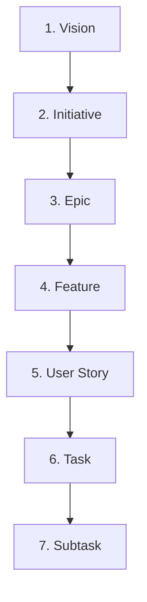

# 08. Technical Backlog Framework & Work Hierarchy

## Executive Summary

The **Technical Backlog Framework** defines how work is structured, prioritized, decomposed, and tracked across **ForgeAI**.

It establishes a 7-tier hierarchy mapping high-level business vision down to actionable subtasks, enabling seamless collaboration between human product managers and autonomous AI Project Manager Agents.

---

## 🏔️ 7-Tier Work Breakdown Structure (WBS)

---

## 📋 Hierarchy Level Specifications

### Level 1: Vision
- **Purpose**: Multi-year strategic direction of the platform.
- **Required Information**: Strategic goal statement, target market outcome.
- **Example**: "Deliver an AI Engineering Platform that orchestrates the end-to-end software development lifecycle."

### Level 2: Initiative
- **Purpose**: Large strategic theme spanning multiple quarters.
- **Required Information**: Executive sponsor, target quarter, success metrics.
- **Example**: "Bi-Directional Model Context Protocol (MCP) Integration & IDE Gateway."

### Level 3: Epic
- **Purpose**: Major feature capability achievable within a single release cycle (1-2 months).
- **Required Information**: DDD Bounded Context scope, architecture blueprint reference, target persona.
- **Example**: "Sandboxed Agent Tool Execution Engine."

### Level 4: Feature
- **Purpose**: Functional capability deliverable in a single sprint (1-2 weeks).
- **Required Information**: Feature specification (adhering to `docs/12-feature-specifications.md`), API routes, domain events.
- **Example**: "Subprocess Process Isolation for Custom Bash/PHP Agent Tools."

### Level 5: User Story
- **Purpose**: User-centric behavior specification written in Gherkin format.
- **Required Information**: `As a [Role], I want [Action] so that [Benefit]`, Given-When-Then acceptance criteria.
- **Example**: "As an Agent Developer, I want custom tool execution to timeout after 10 seconds so that runaway processes do not crash the server."

### Level 6: Task
- **Purpose**: Discrete engineering action assigned to a developer or AI Agent.
- **Required Information**: File paths to modify, target class/method signatures, Pest unit test requirements.
- **Example**: "Create `ProcessSandboxRunner.php` inside `app/Domain/Automation/Services/`."

### Level 7: Subtask
- **Purpose**: Atomic code change, function addition, or documentation line edit.
- **Required Information**: Specific line ranges, regex parameters, or configuration keys.
- **Example**: "Add `--timeout=10` parameter to Process invocation."

---

## 🔗 Related Architecture Documents

- [01-forgeai-constitution.md](file:///home/tristan/Projects/Forge_AI/docs/01-forgeai-constitution.md)
- [03-development-workflow.md](file:///home/tristan/Projects/Forge_AI/docs/03-development-workflow.md)
- [12-feature-specifications.md](file:///home/tristan/Projects/Forge_AI/docs/12-feature-specifications.md)
