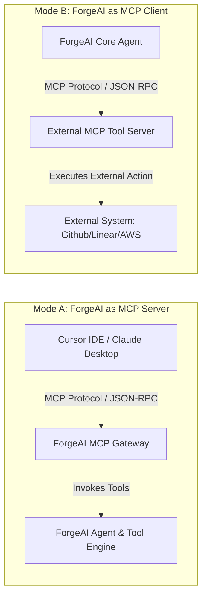

# 09. API Strategy & Model Context Protocol (MCP) Gateway

## Executive Summary

ForgeAI employs a hybrid API architecture designed for both zero-boilerplate internal reactive UI rendering and standard external interoperability.

It leverages **Inertia.js v3 + Wayfinder** for internal reactive communications, versioned **REST/SSE** endpoints for developer API integrations, and a **Bi-Directional Model Context Protocol (MCP) Gateway** for native IDE integrations.

---

## ⚡ Internal API Architecture (Inertia v3 + Wayfinder)

Internal UI communications rely on `@laravel/vite-plugin-wayfinder` / `laravel/wayfinder`.

Controllers expose typed actions directly to Vue 3 components without requiring manually maintained REST endpoint definitions or duplicate TypeScript interfaces:

```typescript
// Wayfinder typed Controller action import in Vue 3
import { runAgentSession } from '@/actions/AgentExecutionController';

const executePrompt = async () => {
    await runAgentSession({
        session_id: activeSession.id,
        prompt: inputPrompt.value,
    });
};
```

---

## 🌐 External RESTful API Conventions (`/api/v1/`)

For third-party developer integrations, external agent calls, and SDK clients, ForgeAI provides a RESTful API:

- **Base Endpoint**: `https://api.forgeai.dev/api/v1`
- **Authentication**: Bearer API tokens (`forge_sec_...`) scoped via Sanctum / Fortify policies.
- **Content Negotiation**: `application/json` for requests; `text/event-stream` for streaming endpoints.
- **Rate Limiting**: Returned via headers (`X-RateLimit-Limit`, `X-RateLimit-Remaining`).

---

## 🔌 Bi-Directional Model Context Protocol (MCP) Gateway

ForgeAI implements the open **Model Context Protocol (MCP)** operating in two modes:



1. **ForgeAI as MCP Server**: Allows external AI tools (Cursor, Windsurf, Claude Desktop) to connect to ForgeAI's Engineering Graph and sandboxed tools.
2. **ForgeAI as MCP Client**: Allows ForgeAI agents to connect dynamically to third-party MCP servers (Linear, GitHub, Figma, PostgreSQL).

---

## 📢 Webhook Delivery Engine

External systems register webhooks to receive real-time notifications on key events:

```
Payload Delivery Headers:
  - X-ForgeAI-Event: agent.session.completed
  - X-ForgeAI-Timestamp: 1784812300
  - X-ForgeAI-Signature: t=1784812300,v1=a5f8... (HMAC-SHA256)
```

---

## 🔗 Related Architecture Documents

- [03-architecture-decision-records.md](file:///home/tristan/Projects/Forge_AI/docs/03-architecture-decision-records.md)
- [04-system-architecture.md](file:///home/tristan/Projects/Forge_AI/docs/04-system-architecture.md)
- [05-modular-architecture.md](file:///home/tristan/Projects/Forge_AI/docs/05-modular-architecture.md)
- [10-security-architecture.md](file:///home/tristan/Projects/Forge_AI/docs/10-security-architecture.md)
