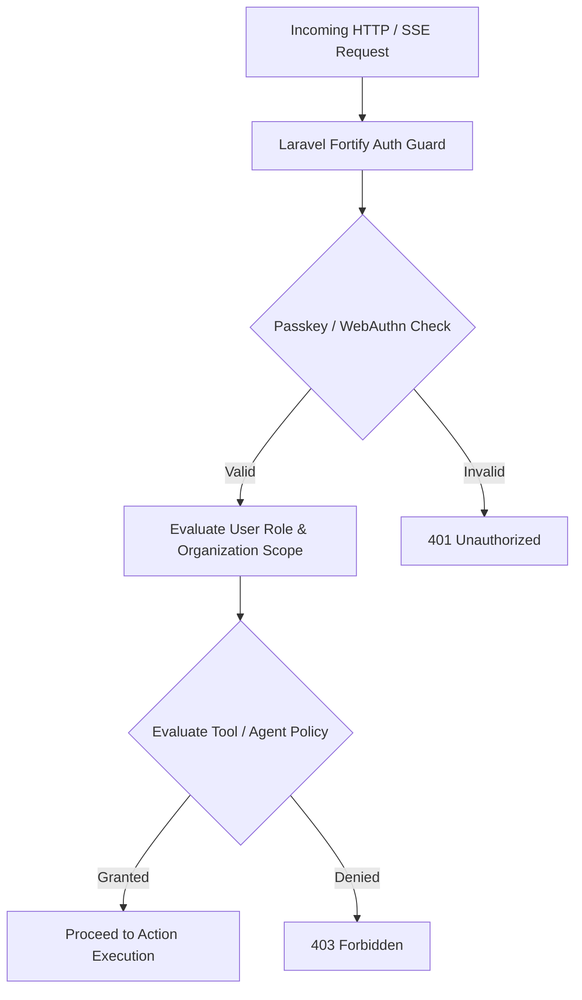
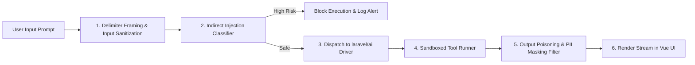

# 10. Security Architecture & Zero-Trust Governance

## Executive Summary

Security in **ForgeAI** is built around a **Zero-Trust Security Model**.

It addresses traditional web security risks (OWASP Top 10) alongside AI-specific vulnerabilities including Indirect Prompt Injection, LLM API Key Exfiltration, Output Poisoning, and Sandboxed Tool Privilege Escalation.

---

## 🔒 Authentication & Access Control (RBAC / ABAC)

### Access Control Matrix

| Role | Organization Scope | Agent Config | Tool Execution | Token Quota Mgmt | System Settings |
|---|---|---|---|---|---|
| `SuperAdmin` | Global (All Orgs) | Read / Write | Full Execution | Read / Write | Full System Control |
| `OrganizationAdmin` | Single Tenant | Read / Write | Full Execution | Read / Write | Tenant Settings |
| `AgentDeveloper` | Single Tenant | Read / Write | Sandboxed Exec | Read Only | None |
| `AgentUser` | Single Tenant | Read Only | Standard Exec | None | None |

---

## 🛡️ AI Security & Prompt Injection Shields

### Defense Specifications:
1. **Prompt Framing Encapsulation**: Untrusted user inputs and RAG context chunks are strictly wrapped inside explicit XML/delimiter frames (e.g. `<untrusted_rag_chunk>...</untrusted_rag_chunk>`) with system instructions explicitly barring agents from executing commands contained within untrusted tags.
2. **Output PII & Secrets Masking**: Agent outputs pass through regex and entropy filters to redact API keys (`sk-...`, `ghp_...`), AWS credentials, and PII before rendering to the UI or saving to session history.

---

## 🔑 Secrets Management & Supply Chain Protection

1. **Encryption at Rest**: Tenant-provided LLM API keys are encrypted in PostgreSQL using **AES-256-GCM** via Laravel's native Encrypter.
2. **Zero-Log Guarantee**: Raw API keys and secret bearer tokens are explicitly stripped from all log outputs, stack traces, and `laravel/pail` debug streams.
3. **Supply Chain Security**: Dependency builds enforce locked `composer.lock` and `package-lock.json` files validated against automated security advisory databases.

---

## 🔗 Related Architecture Documents

- [03-architecture-decision-records.md](file:///home/tristan/Projects/Forge_AI/docs/03-architecture-decision-records.md)
- [04-system-architecture.md](file:///home/tristan/Projects/Forge_AI/docs/04-system-architecture.md)
- [06-security-architecture.md](file:///home/tristan/Projects/Forge_AI/docs/06-security-architecture.md)
- [09-api-strategy.md](file:///home/tristan/Projects/Forge_AI/docs/09-api-strategy.md)
