# 10. Standard Tool Registry & Interface Specifications

## Executive Summary

The **ForgeAI Tool Registry** defines the standardized interfaces, parameter JSON Schemas, permission constraints, and sandboxing requirements for all agent tools.

Tools serve as the execution arms for AI agents, interacting with filesystem resources, version control, database queries, terminal commands, and external APIs.

---

## 🛠️ Tool Interface Architecture (`ToolDefinition`)

Every tool in ForgeAI implements a standardized PHP interface wrapped by `laravel/ai`:

```php
namespace App\Domain\Automation\Contracts;

interface ToolInterface {
    public function name(): string;
    public function description(): string;
    public function parameterSchema(): array; // Standard JSON Schema
    public function requiresHumanApproval(): bool;
    public function execute(array $parameters): ToolResult;
}
```

---

## 📋 Master Tool Category Registry (13 Categories)

```mermaid
graph TD
    Tools[ForgeAI Tool Registry]
    
    Tools --> T1[1. Filesystem Tools]
    Tools --> T2[2. Git Tools]
    Tools --> T3[3. GitHub Tools]
    Tools --> T4[4. Terminal Sandboxed Tools]
    Tools --> T5[5. Search & Vector Tools]
    Tools --> T6[6. Browser Automation Tools]
    Tools --> T7[7. Database Query Tools]
    Tools --> T8[8. Docker Container Tools]
    Tools --> T9[9. Kubernetes Cluster Tools]
    Tools --> T10[10. MCP Gateway Tools]
    Tools --> T11[11. Documentation Tools]
    Tools --> T12[12. Pest Testing Tools]
    Tools --> T13[13. Deployment Tools]
```



---

## 📑 Detailed Category Specifications

### 1. Filesystem Tools (`category: filesystem`)
- **Purpose**: File reads, writes, directory listings, and diff applications inside workspace boundaries.
- **Permissions**: Sandboxed workspace paths only. Writing to system directories (`/etc`, `/usr`) is strictly blocked.
- **HITL Approval**: Required for deleting files or batch overwriting > 5 files.

### 2. Git Tools (`category: git`)
- **Purpose**: Branch creation, commit staging, diff inspections, and log history viewing.
- **HITL Approval**: Required for hard resets (`git reset --hard`) or force pushes.

### 3. GitHub Tools (`category: github`)
- **Purpose**: Pull Request creation, issue updates, comment posting, and review status checks.

### 4. Terminal Sandboxed Tools (`category: terminal`)
- **Purpose**: Execution of sandboxed shell commands (e.g. `composer install`, `npm run build`).
- **Sanitizing**: Restricted process execution under 128MB RAM caps and 10s execution timeouts.
- **HITL Approval**: Required for mutating shell commands.

### 5. Search & Vector Tools (`category: search`)
- **Purpose**: Ripgrep text search, Engineering Graph queries, and pgvector cosine similarity searches.

### 6. Browser Automation Tools (`category: browser`)
- **Purpose**: E2E browser page navigation, DOM inspection, screenshot capture, and visual regression checks.

### 7. Database Query Tools (`category: database`)
- **Purpose**: Inspection of database schemas (`database-schema`) and read-only SELECT queries (`database-query`).
- **Permissions**: Read-only DB access. Mutating SQL queries (`DROP`, `DELETE`, `UPDATE`) require explicit HITL approval.

### 8. Docker Tools (`category: docker`)
- **Purpose**: Inspection of running containers, build status, and log output.

### 9. Kubernetes Tools (`category: k8s`)
- **Purpose**: Cluster pod inspection, deployment status, and service configuration viewing.

### 10. Model Context Protocol (MCP) Tools (`category: mcp`)
- **Purpose**: Bi-directional communication with external MCP tool servers (Linear, Figma, AWS).

### 11. Documentation Tools (`category: docs`)
- **Purpose**: Creating and modifying `/docs` architecture blueprints and ADRs.

### 12. Testing Tools (`category: pest`)
- **Purpose**: Invocation of Pest unit, feature, arch, and eval test suites (`php artisan test`).

### 13. Deployment Tools (`category: deployment`)
- **Purpose**: Triggering release pipelines and verifying deployment health check endpoints.
- **HITL Approval**: ALWAYS required for production release triggers.

---

## 🔗 Related Architecture Documents

- [03-ai-and-agent-framework.md](file:///home/tristan/Projects/Forge_AI/docs/03-ai-and-agent-framework.md)
- [07-agent-framework.md](file:///home/tristan/Projects/Forge_AI/docs/07-agent-framework.md)
- [09-agent-specifications.md](file:///home/tristan/Projects/Forge_AI/docs/09-agent-specifications.md)
