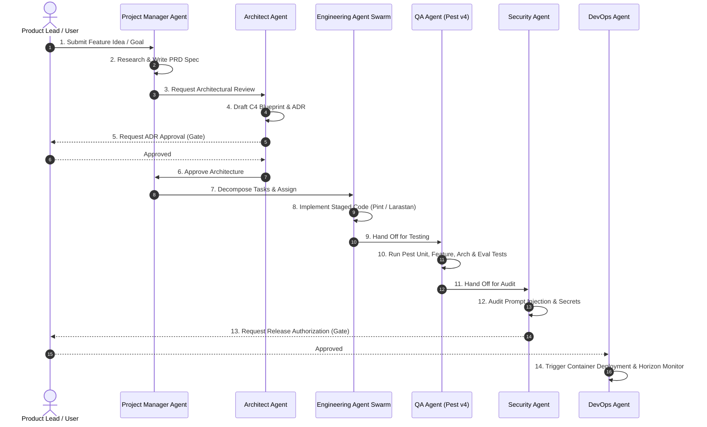

# 12. Canonical Implementation Lifecycle Blueprint

## Executive Summary

This document illustrates the **Canonical Implementation Lifecycle** for **ForgeAI**.

It provides the authoritative step-by-step operational blueprint detailing how an initial idea or feature request transitions through specification, architecture, ADR creation, multi-agent implementation, Pest v4 testing, security auditing, container deployment, real-time monitoring, and continuous improvement.

---

## 🔄 End-to-End Implementation Lifecycle Map

---

## 📑 Detailed Lifecycle Steps & Quality Gates

### Step 1: Idea Inception & Goal Definition
- **Owner**: Human Product Lead / User.
- **Deliverable**: High-level feature request in workspace.
- **Quality Gate**: Alignment with `docs/00-overview.md` strategic vision.

### Step 2: Research & PRD Specification
- **Owner**: Project Manager Agent (`AGENT-001`).
- **Deliverable**: Feature specification saved to `docs/12-feature-specifications.md`.
- **Quality Gate**: Complete Gherkin Given-When-Then user stories defined.

### Step 3: Architecture & DDD Context Mapping
- **Owner**: Architect Agent (`AGENT-002`).
- **Deliverable**: C4 diagram, domain boundary mapping under `app/Domain/`.
- **Quality Gate**: Zero boundary leaks between domain contexts.

### Step 4: ADR Creation & Review
- **Owner**: Architect Agent (`AGENT-002`).
- **Deliverable**: New record in `docs/adrs/`.
- **Quality Gate**: Human Lead approval required for breaking architectural changes.

### Step 5: Issue Creation & Task Decomposition
- **Owner**: Project Manager Agent (`AGENT-001`).
- **Deliverable**: GitHub Issues tagged with target persona, file scopes, and Pest test requirements.

### Step 6: Multi-Agent Staged Implementation
- **Owner**: Backend (`AGENT-003`) & Frontend (`AGENT-004`) Agents.
- **Deliverable**: Staged code changes.
- **Quality Gate**: `vendor/bin/pint --test` and `vendor/bin/phpstan analyse` (Level 8) pass with zero errors.

### Step 7: Automated Pest v4 Testing & Evals
- **Owner**: QA Engineer Agent (`AGENT-008`).
- **Deliverable**: Pest unit, feature, arch, and LLM eval benchmarks.
- **Quality Gate**: 100% test pass rate via `composer run ci:check`.

### Step 8: Security Audit & Prompt Injection Scan
- **Owner**: Security Engineer Agent (`AGENT-007`).
- **Deliverable**: Security audit report.
- **Quality Gate**: Zero PII leaks, encrypted API keys, passed prompt injection shields.

### Step 9: Documentation Synchronization
- **Owner**: Documentation Engineer Agent (`AGENT-009`).
- **Deliverable**: Updated `/docs` blueprints, API catalogues, and `AGENTS.md`.
- **Quality Gate**: All links syntactically valid.

### Step 10: Staged Deployment & Horizon Monitoring
- **Owner**: DevOps Engineer Agent (`AGENT-006`) + Human Release Approval.
- **Deliverable**: Production FrankenPHP container release.
- **Quality Gate**: Zero-downtime deployment, passing `/up` health checks, active Redis Horizon monitoring.

---

## 🔗 Related Architecture Documents

- [01-forgeai-constitution.md](file:///home/tristan/Projects/Forge_AI/docs/01-forgeai-constitution.md)
- [03-development-workflow.md](file:///home/tristan/Projects/Forge_AI/docs/03-development-workflow.md)
- [05-definition-of-done.md](file:///home/tristan/Projects/Forge_AI/docs/05-definition-of-done.md)
- [13-implementation-roadmap.md](file:///home/tristan/Projects/Forge_AI/docs/13-implementation-roadmap.md)
