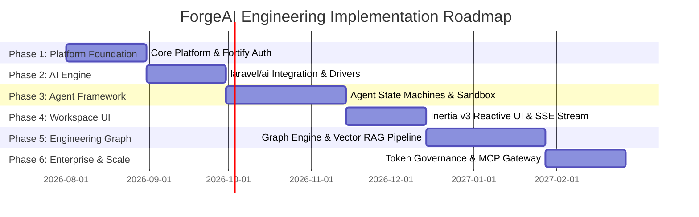

# 13. Phased Implementation Roadmap

## Executive Summary

This document defines the phased implementation roadmap for **ForgeAI**.

The engineering timeline is structured into 6 sequential phases designed to deliver value iteratively while guaranteeing architectural integrity, security, and performance at every milestone.

---

## 🗺️ Master Roadmap Timeline Overview

---

## 🚀 Phase Breakdown & Exit Criteria

### Phase 1 — Platform Foundation & Multi-Tenant Core
* **Objectives**: Establish Laravel 13 core, multi-tenant organization models, Fortify authentication, Passkey WebAuthn setup, and initial Vue 3 Inertia app frame.
* **Deliverables**:
  - `Domain/AuthTenant` module with Fortify and Passkey auth flows.
  - Organization tenant isolation middleware.
  - Pest test suites (`tests/Feature/AuthTest.php`).
* **Exit Criteria**: 100% passing Pest tests, zero Larastan static analysis errors, working passkey registration in staging.

### Phase 2 — AI Engine Abstraction & Multi-Provider Cascade
* **Objectives**: Integrate `laravel/ai` SDK (`Laravel\Ai\*`), configure OpenAI, Anthropic, Gemini, and Ollama drivers, and build provider failover circuit breakers.
* **Deliverables**:
  - `Domain/AIEngine` module wrapping `laravel/ai`.
  - Automated fallback cascade driver policies.
  - Mock testing suite (`Ai::fake()`) verifying provider switching.
* **Exit Criteria**: Verified provider failover under simulated HTTP 429/500 errors; sub-400ms TTFT streaming benchmarks.

### Phase 3 — Multi-Agent Framework & Sandboxed Tooling
* **Objectives**: Implement the 10 Specialist Agent Personas, agent state machines, tool definitions, and sandboxed subprocess execution runners.
* **Deliverables**:
  - `Domain/Agent` and `Domain/Automation` modules.
  - Subprocess runner with 128MB RAM and 10s execution limits.
  - Human-in-the-Loop (HITL) approval gate middleware.
* **Exit Criteria**: Sandboxed tools pass security isolation audits; HITL gates halt execution cleanly on unapproved mutating calls.

### Phase 4 — Reactive Workspace & Real-Time SSE Streams
* **Objectives**: Build the interactive Vue 3 workspace interface with real-time SSE token streaming via Inertia v3 and Wayfinder route functions.
* **Deliverables**:
  - Vue 3 workspace views, chat components, tool execution drawers.
  - Inertia v3 SSE streaming controllers.
  - Tailwind CSS v4 styling and Reka UI integration.
* **Exit Criteria**: Smooth typing-style token streams without UI re-render lag or frame drops.

### Phase 5 — Knowledge Hub & Engineering Graph
* **Objectives**: Build the Engineering Graph indexing engine and PostgreSQL `pgvector` RAG pipeline.
* **Deliverables**:
  - `Domain/EngineeringGraph` with recursive CTE traversal queries.
  - `Domain/KnowledgeVector` document chunking and HNSW vector search.
* **Exit Criteria**: Sub-15ms recursive graph query traversals; sub-10ms vector similarity searches across 100,000 document chunks.

### Phase 6 — Enterprise Governance, MCP Gateway & Marketplace
* **Objectives**: Finalize Token Usage Ledgers, enterprise token budget enforcement, Bi-directional Model Context Protocol (MCP) Gateway, and Plugin Marketplace.
* **Deliverables**:
  - `Domain/Governance` token cost accounting and rate limiters.
  - Bi-directional MCP JSON-RPC gateway server/client.
  - Plugin extension loader.
* **Exit Criteria**: Successful end-to-end integration test with external Cursor IDE via MCP protocol; 100% token budget enforcement compliance under load.

---

## 🔗 Related Architecture Documents

- [00-overview.md](file:///home/tristan/Projects/Forge_AI/docs/00-overview.md)
- [01-product-requirements.md](file:///home/tristan/Projects/Forge_AI/docs/01-product-requirements.md)
- [05-modular-architecture.md](file:///home/tristan/Projects/Forge_AI/docs/05-modular-architecture.md)
- [11-development-standards.md](file:///home/tristan/Projects/Forge_AI/docs/11-development-standards.md)
